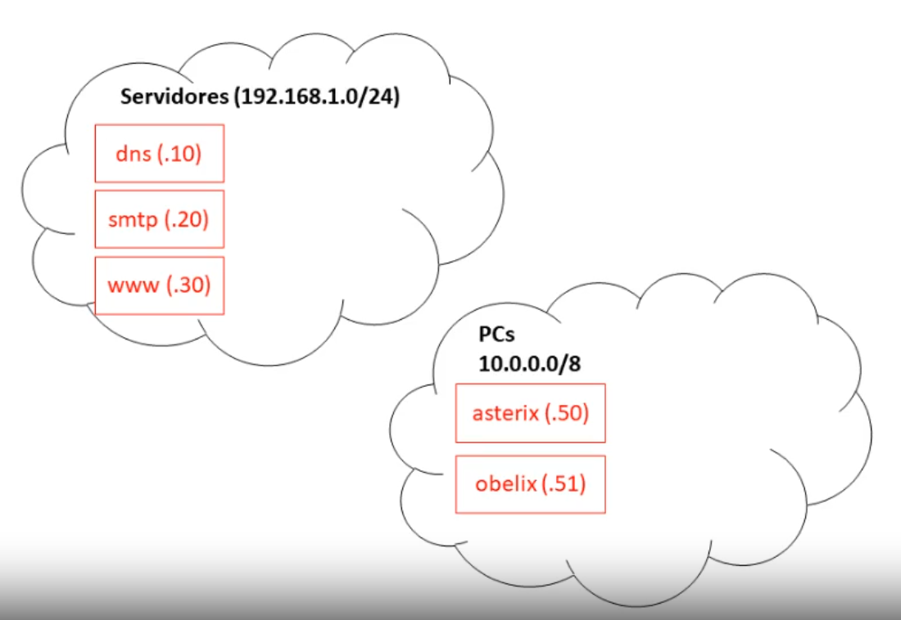
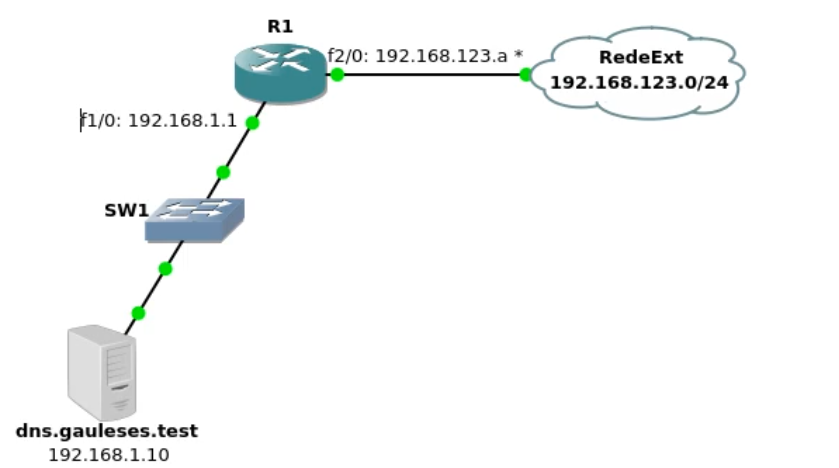
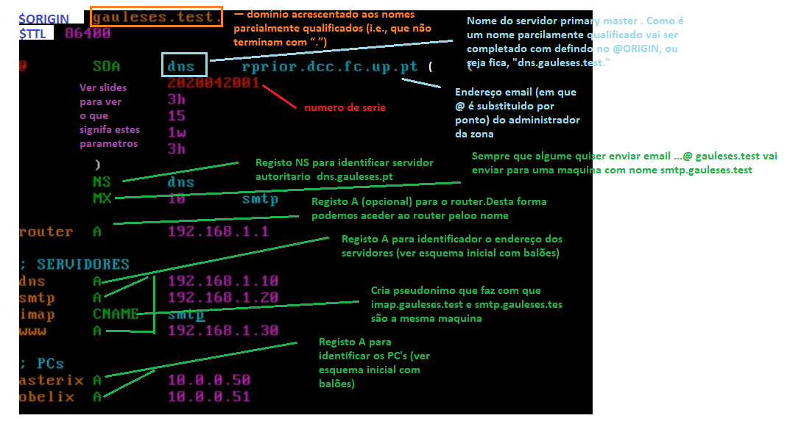
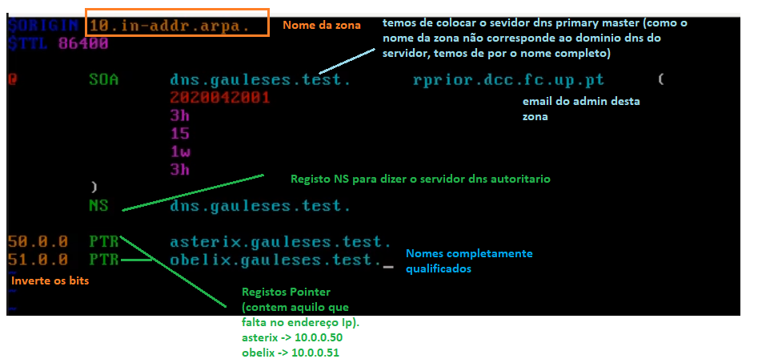

# MUITO IMPORTANTE

```Sempre que alteramos um ficheiro de zona``` devemos ```incrementar o numero de serie```

# Apontamentos  de configuração de servidores DNS - Parte 1: Master

> Nas configurações de zonas acho que falta um ponto no email do administrador






**Notas:**

+ Temos uma subredes de Servidores (```192.168.1.0/24```) em que vamos configurar ```Servidor DNS``` na zona ```gauleses.test```

+ A parte de ```rede Ip``` já esta configurada


## Configuração DNS


```Servidor dns.gauleses.test```

1. Editar **ficheiro de configuração dns principal** (```named.conf```) 

    	$ sudo nano /etc/named.conf 

+  Remover linhas ou comentar as seguintes linhas 


```listen-on port 53 { 127.0.0.1; };``` (Fica apenas a escuta no localhost, vem configurado assim por questões de segurança)

```listen-on-v6 port 53 { ::1; }; ``` (mesma coisa mas para IPV6)


Como se trata de um ```Servidor DNS master``` tem de aceitar **pedidos** vindos de qualquer lugar na internet(esta linha so permitia aceitar pedidos locais, vem configurado assim por questões de segurança)


Como se trata de um ```Servidor DNS master``` (**servidor autoritario**), é indicado para desativar porque pode trazer problemas de segurança


Como se trata de um ```Servidor DNS master``` e não vai ser usado para ```caching```


+ Adicionamos ou modificamos 

Para facilitar a **visualização das capturas** e não vai ser dado nesta  


Para facilitar a **visualização das capturas** e não vai ser dado nesta cadeira 


+ Linhas importantes do ```named.conf```

**Diretorio de base para os ficheiros** 


### Criação de ficheiro de chave (configuração de chave secreta entre rndc e named, para tornar comunicação segura e rndc poder controlar named remotamente)

1. rndc-confgen -a -b 384 -k rndc-key


(conteudo de /etc/rdnc.key (exemplo))


2. Tornar ```rdnc.key``` legivel para ```named```

    + chgrp named rndc.key

    + chmod 640 rndc.key 

3. criar ficheiro ```/etc/rndc.conf```

    + sudo nano /etc/rndc.conf (colocar conteudo abaixo)


4. Configurar no ```/etc/named.conf```


    + sudo nano /etc/named.conf (colocar conteudo abaixo, e comum colocar antes do logging)


5. Verificar configuração ```/etc/named.conf``` ate ao momento

    + ```named-checkconf```

### Criação de zonas 


1. Editar ficheiro ```/etc/named.conf```

    + ```Zona de resolução direta``` (neste caso **gauleses.test**)


+ ```Zonas de resolução inversa``` (**192.168.1.0/24** e **10.0.0.0/8**)


> **Nota:** so a parte que representa a ```sub-rede``` e que entra na ```ordem reversa```  

2. Verificar configuração ```/etc/named.conf``` ate ao momento

    + ```named-checkconf```


3. Criar diretorios para conter os ```ficheiros de zona```

    + mkdir /var/named master 

    + mkdir /var/named reverse  

4. Tornar  diretorios com ```ficheiros de zona``` acessiveis por o ```named```

    + chgrp named /var/named/master

    + chmod 750 /var/named/master
    
    + chgrp named /var/named/reverse

    + chmod 750 /var/named/reverse


5. Criar  e preencher ficheiro para ```Zona de resolução direta``` (no caso e **gauleses.test.zone**)

    +  touch /var/named/master/gauleses.test.zone
        
        + chgrp named /var/named/master/gauleses.test.zone

        + chmod 640  /var/named/master/gauleses.test.zone

    + nano  /var/named/master/gauleses.test.zone





> Verificar configurações desta zona com ```named-checkzone gauleses.test gauleses.test.zone```

> **Nota**: uma zona é uma ```lista de registos```

6. Criar e preencher ficheiros para ```Zonas de resolução inversa``` (no caso **192.168.1.zone** e **10.zone**)

    + touch /var/named/reverse/192.168.1.zone

        + chgrp named /var/named/reverse/192.168.1.zone

        + chmod 640  /var/named/reverse/192.168.1.zone

    + touch  /var/named/reverse/10.zone

        + chgrp named /var/named/reverse/10.zone

        + chmod 640  named /var/named/reverse/10.zone


    + nano  /var/named/reverse/10.zone




> Verificar configurações desta zona com ```named-checkzone 10.in-addr.arpa 10.zone```


+ nano  /var/named/reverse/192.168.1.zone


> Verificar configurações desta zona com ```named-checkzone 1.168.192.in-addr.arpa 192.168.1.zone```


## Testar configurações 

1. sysctemctl enable --now named 

2. sysctemctl status named 

3. cat /etc/resolv.conf


4. host smtp 


5. host imap 


6. host 192.168.1.30


7. host 10.0.0.50

