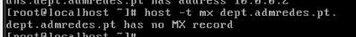
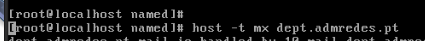

# Trabalho 4 - DNS


**Nota prévias:**
+ O comando ```rndc``` usa-se para **controlar** (**local** ou **remotamente**) o ```servidor de nomes``` (**named**), e.g., para carregar uma **configuração actualizada** (```rndc reload```) ou para **limpar a cache** (```rndc flush```). 

+ Por uma questão de segurança, é aconselhável mudar a chave default para comunicação entre o rndc e o named. Pode gerar uma nova chave usando o seguinte comando:

    ```bash
    rndc-confgen -a -b 384 -k rndc-key
    ```
    Este comando cria (ou modifica) o ficheiro /etc/rndc.key, com a definição de uma chave com o seguinte aspecto:

    ```bash
    key "rndc-key" {
            algorithm hmac-md5;
            secret "TqeiABSAEUqqREJhDDkHrcMK9o7mnNihXEbMAW/dBSU=";
    };
    ```
    Se o ficheiro /etc/rndc.conf existir, certifique-se de que não contém a definição dessa chave (se contiver, apague-a) mas inclui o /etc/rndc.key. Exemplo de configuração:

    ```bash
    include "/etc/rndc.key";
    options {
        default-server   localhost;
        default-key      rndc-key;
    };
    ```

    Faça o mesmo em relação ao ficheiro /etc/named.conf, certificando-se ainda de que a secção controls está configurada para usar a chave definida, e.g.:

    ```bash
    include "/etc/rndc.key";
    controls {
        inet 127.0.0.1 port 953
        allow { 127.0.0.1; } keys { rndc-key; };
    };
    ```

    Altere o grupo e as permissões do ficheiro com a chave usando

    ```bash
    chgrp named rndc.key
    chmod 640 rndc.key
    ```


+ Para **verificar** se o ```named.conf``` e os ```ficheiros de zona``` estão correctos pode **utilizar**, respectivamente, ```named-checkconf``` e ```named-checkzone zone file```, onde **file** é o **pathname** do ```ficheiro de zona```. **Faça sempre estes testes antes de pôr o serviço a correr**.

+ Sempre que **alterar as configurações** e fizer **rndc reload** para as activar, verifique nos logs que não ocorreram erros. 

+ Para **resolver nomes**, usam-se os comandos ```host``` ou ```dig```. Normalmente, o servidor a consultar é o indicado no ficheiro /etc/resolv.conf, que é actualizado ao obter endereços por DHCP. Se quisermos usar outro servidor (e.g., 172.16.0.2), podemos especificá-lo na linha de comando:

    ```bash
    host www.dcc.fc.up.pt 172.16.0.2
    dig @172.16.0.2 www.dcc.fc.up.pt
    ```


+ host www.dcc.fc.up.pt 172.16.0.2


dig @172.16.0.2 www.dcc.fc.up.pt


+ Por **questões de segurança**, o bind (**processo named**) não corre como root, mas sim como ```named```. Para que possa **ler os ficheiros de zona**, certifique-se de que estes pertencem ao ```grupo named``` e são ```legíveis pelo grupo```. 


 

## Configurações prévias

### Em cada um dos servidores DNS (dns.admredes.pt e dns.dept.admredes.pt) execute os seguintes comandos:

> **Notas** Antes de fazer estes passo, importar as configurações iniciais do router R1.

```bash
rndc-confgen -a -b 384 -k rndc-key
```
Este comando cria (ou modifica) o ficheiro /etc/rndc.key, com a definição de uma chave com o seguinte aspecto:

```bash

key "rndc-key" {
        algorithm hmac-md5;
        secret "TqeiABSAEUqqREJhDDkHrcMK9o7mnNihXEbMAW/dBSU=";
};
```
Se o ficheiro /etc/rndc.conf existir, certifique-se de que não contém a definição dessa chave (se contiver, apague-a) mas inclui o /etc/rndc.key. Exemplo de configuração:
```bash
include "/etc/rndc.key";
options {
    default-server   localhost;
    default-key      rndc-key;
};
```
Faça o mesmo em relação ao ficheiro /etc/named.conf, certificando-se ainda de que a secção controls está configurada para usar a chave definida, e.g.:

> **Notas** Remover as duas primeiras linhas do options

O servidor DNS ficava a escutar apenas no host
Remover a linha:

Permite apenas pedidos vindos do localhost
E por fim remover tambem a seguinte linha:

De seguida fazer restart da configuraçao com o seguinte comando:
**systemctl reload named**


```bash
include "/etc/rndc.key";
controls {
    inet 127.0.0.1 port 953
    allow { 127.0.0.1; } keys { rndc-key; };
};
```

Por fim  alterar o grupo e as permissões do ficheiro com a chave usando
    
```bash
    chgrp named /etc/rndc.key
    chmod 640 /etc/rndc.key
```

Depois de fazer estes passos correr este comando para verificar se o ficheiro tem erros.
    
```bash
    named-checkconf
```


###  De seguida iniciar o serviço named

```bash
systemctl start named
```


## Continuar com o que esta para baixo da figura (Objetivos)