# Trabalho 3 - DHCP e NAT


> **Notas**

+ Para parar o ```debug ip nat detailed``` basta fazer no router em que foi ativado o comando ````no debug ip detailed``` (mesmo que estejam a **receber mensagens enquanto digitamos**)

## 1. Nos terminais 1 e 2 desactive a interface de rede ( nmcli con down ens3 ) e limpe a cache do dhclient com  rm -f /var/lib/{dhclient,NetworkManager}/*.lease . Limpe também em RCis eventuais leases anteriores com  clear ip dhcp binding * .

```Terminal 1 e 2```

    nmcli con down ens3

    # limpar cache dhcp
    rm -f /var/lib/{dhclient,NetworkManager}/*.lease


```RCis```

> **Nota**: só apaga binding dinâmicos (aqueles que foram configurados estaticamente ou manualmente ficam)
    clear ip dhcp binding * 

### a. Inicie uma captura wireshark na interface f1/1 de RCis e volte a activar a interface ens3 do terminal 1. Repita o procedimento para o terminal 2. As capturas devem mostrar o conteúdo das mensagens. (2 × capRes)


```Terminal 1```

    nmcli con up ens3

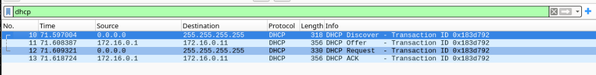


+ ```DHCP Discover``` (Usada pelo cliente para descobrir servidor(es) DHCP existente(s))

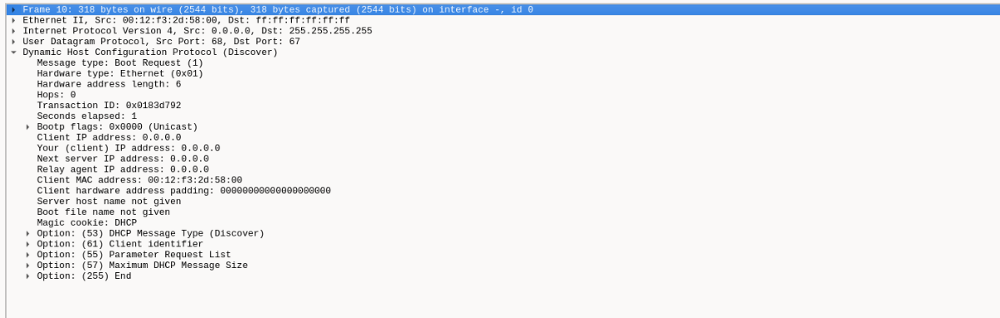

+ ```DHCPOFFER``` (Usada para um servidor oferecer uma configuração a um cliente)

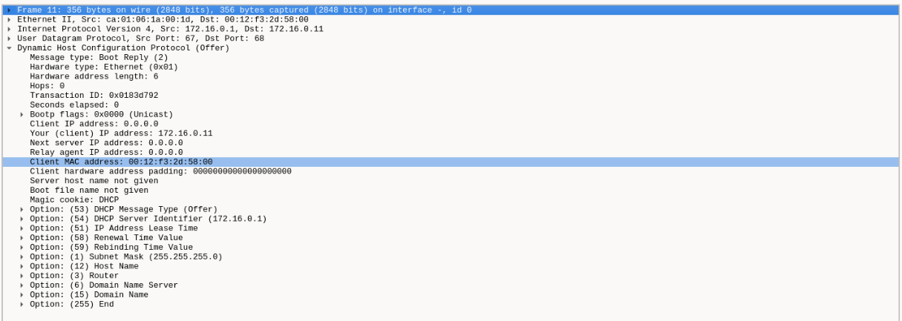

+ ```DHCPREQUEST``` (Usada pelo cliente para pedir uma dada configuração)

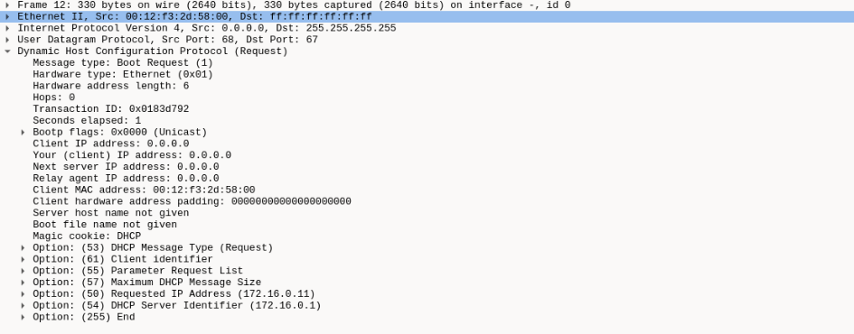

```DHCPACK``` (Usada pelo servidor para confirmar a atribuição da configuração)
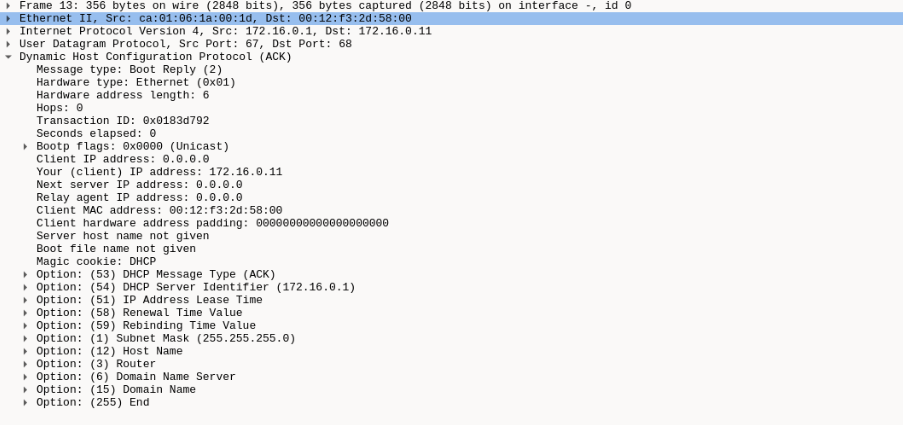

```Terminal 2```

    nmcli con up ens3

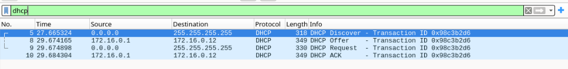


+ ```DHCP Discover``` (Usada pelo cliente para descobrir servidor(es) DHCP existente(s))

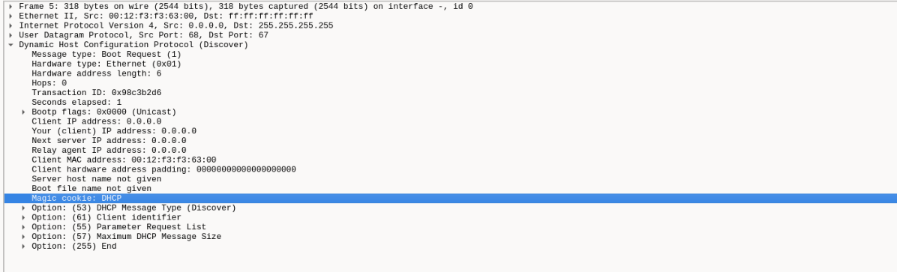

+ ```DHCPOFFER``` (Usada para um servidor oferecer uma configuração a um cliente)

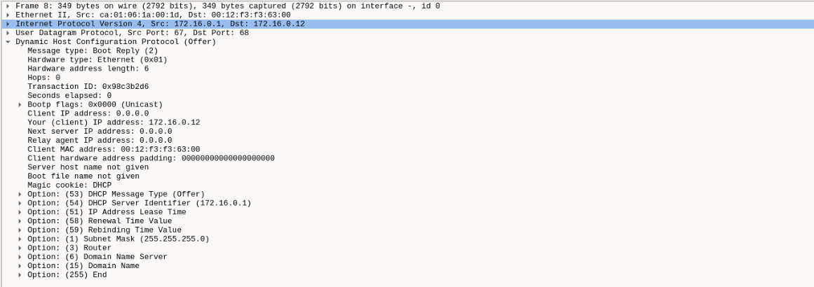

+ ```DHCPREQUEST``` (Usada pelo cliente para pedir uma dada configuração)

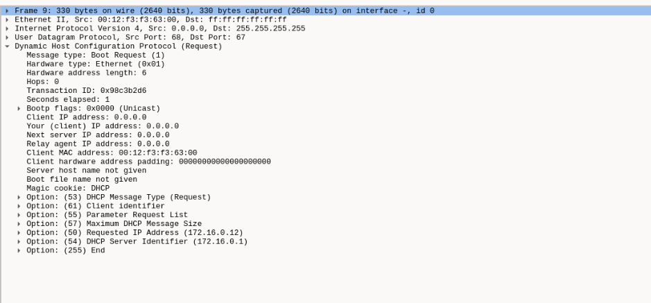

```DHCPACK``` (Usada pelo servidor para confirmar a atribuição da
 configuração)
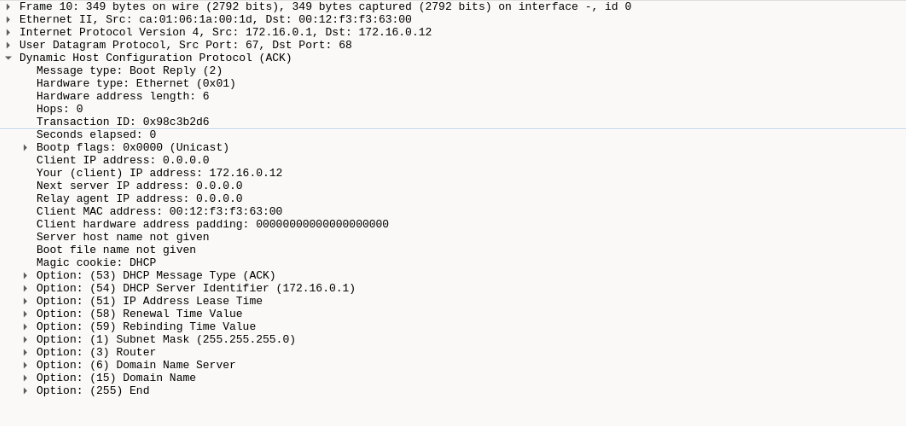

### b. Apenas a partir das mensagens capturadas e respectivo conteúdo é possível saber qual dos dois tem um endereço fixo


R: Não porque o DHCP apenas é um protocolo que atribui endereços, esse conceito de ser fixo ou não é interno a propria maquina, e indeferente para o dhcp


## 2. No router RCis active o debugging do NAT com o comando  debug ip nat detailed . No terminal 1, faça download do ficheiro http://193.137.35.140/favicon.ico (use o wget). Referindo-se explicitamente às linhas de output de RCis, explique o trabalho do NAT (outRes + texRes).


```RCis```

    debug ip nat detailed

```Terminal 1```

    wget http://193.137.35.140/favicon.ico


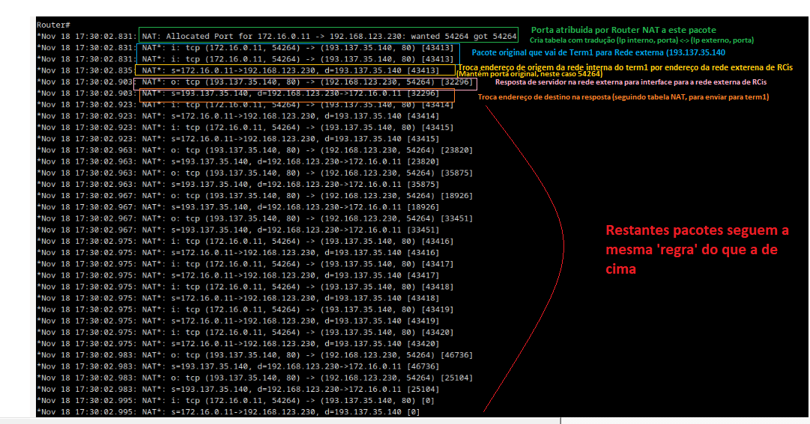


## 3.Desactive a interface de rede do terminal 2, desligue-o do SW2 e ligue-o no SW1, e volte a activá-la. Veja que endereço lhe foi atribuído (deve ser da rede 192.168.123.0/24).Do terminal 1, faça um ssh para o terminal 2 ( ssh ar@<ip_term2> ). Nessa shell, corra o comando  while true; do echo hello; sleep 1; done  para que o servidor ssh vá gerando pacotes. Explique o que acontece quando usa o comando  clear ip nat translation *  e comente a afirmação Quando usamos NAT com tradução de portas, os fluxos de pacotes passam de connectionless para connection-oriented. (texRes)

>```NOTAS:```

>(1) A conexão deve cair. Eventualmente, pode ter que correr mais que uma vez o comando para limpar os mapeamentos NAT, pois o que acontece depende da ordem dos pacotes de entrada e saída.

>(2) Para perceber melhor o que se passa, pode fazer capturas nas duas interfaces de RCis.


    Desactive a interface de rede do terminal 2, desligue-o do SW2 e ligue-o no SW1, e volte a activá-la

```Terminal 2``` 
        
        nmcli con down ens3

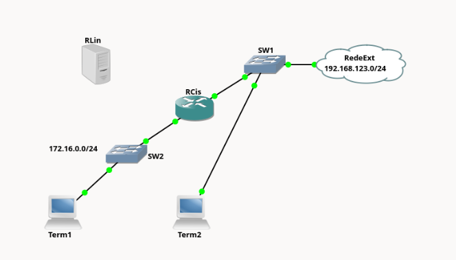

        nmcli con up ens3

****
    Veja que endereço lhe foi atribuído (deve ser da rede 192.168.123.0/24)

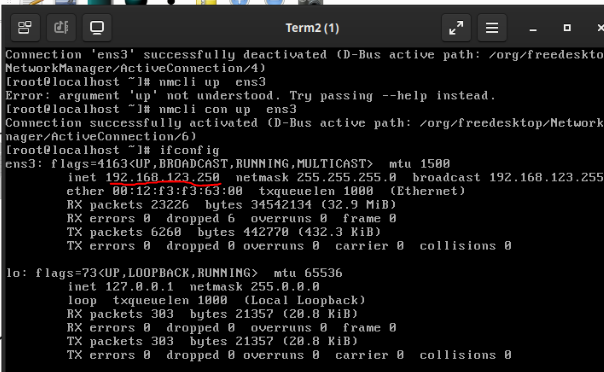

    Do terminal 1, faça um ssh para o terminal 2 ( ssh ar@<ip_term2> ).

    Nessa shell, corra o comando  while true; do echo hello; sleep 1; done  para que o servidor ssh vá gerando pacotes. 

    Explique o que acontece quando usa o comando  clear ip nat translation *.
```RCis```

    1. enable
    2. clear ip nat translation * 

    R: Quando executamos no router RCis clear ip nat translation * , ele limpa todas as entradas da tabela NAT .

        Impacto:

        ---> A conexão SSH entre os terminais é interrompida imediatamente.

        ---> Isso ocorre porque os pacotes subsequentes não encontram uma tradução válida no NAT e, portanto, não podem ser roteados corretamente entre as redes privada e pública.

        ---> O fluxo gerado pelo comando while true; do echo hello; sleep 1; done também será interrompido, pois depende da conexão SSH.

    comente a afirmação Quando usamos NAT com tradução de portas, os fluxos de pacotes passam de connectionless para connection-oriented.


        R:Esta afirmação é parcialmente verdadeira, mas precisa de esclarecimento:
    
+ ```NAT``` por si só **não transforma** ```protocolos connectionless``` em ```connection-oriented```:

    + NAT opera no nível de camada 3 (IP) e camada 4 (TCP/UDP).
    
    + **Protocolos como UDP continuam sendo connectionless, mesmo passando pelo NAT.**
        
+ A ```tabela NAT``` introduz um **aspecto de estado** que **simula conexão**:

    + Para **traduzir** os ```endereços``` e ```portas``` corretamente, o ```NAT``` mantém uma ```tabela de estado```, que **associa fluxos de pacotes**.

    + Por isso, do **ponto de vista** do ```NAT```, mesmo **fluxos UDP** (```connectionless```) **aparentam ser** "```connection-oriented```", pois ele **requer informações de início e fim do fluxo.**


## 4. Ainda com o terminal 2 ligado no SW1, faça um ssh desse terminal para o terminal 1


### a. Indique o comando utilizado

**duvida: o ssh abaixo não funciona?**

**duvida: O facto de ssh de Term1 para Term2 funcionar, nas o contrário não deve-se a alguma coisa relacionada com nat??**

    R: Term2 $ ssh ar@172.16.0.11


### b. Identifique uma situação em que é necessário fazer port forwarding usando uma porta não-standard. 

```Cenário: Restrição no ISP (Provedor de Internet)```

+ Situação: Muitos provedores de internet **bloqueiam portas padrão** como a ```porta 80``` (HTTP) e a ```porta 443``` (HTTPS) em conexões residenciais para evitar que os usuários hospedem servidores web diretamente. Isso é feito por questões de segurança ou para forçar os usuários a contratar planos empresariais.

+ Solução com ```Port Forwarding```:

    + Suponha que você está hospedando um ```servidor web local``` na ```porta 80``` do seu **computador na rede interna**.

    + No ```roteador```, **configure** um redirecionamento de porta (```port forwarding```) da ```porta pública 8080``` para a ```porta interna 80``` no **IP local do servidor**.

    + Agora, **usuários externos** podem acessar o ```servidor we```b usando a ```porta não-standard 8080```, por exemplo: **http://<seu_ip>:8080**.


## 5. Substitua na rede o RCis pelo RLin: desligue RCis de SW1 e SW2 e ligue a interface ens3 de RLin ao SW1 e a interface ens4 ao SW2 e faça no RLin uma configuração idêntica à configuração inicial do RCis. O terminal 2 deve continuar ligado ao SW1.

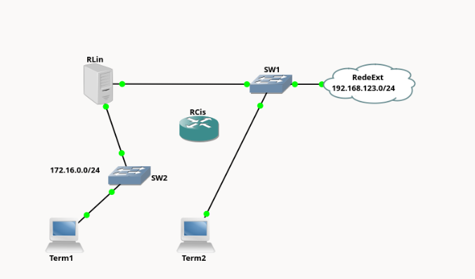

>Configurações do ```RLin``` estão no ficheiro **config_inicias.md**


> ```Nota:``` 
+ Certifique-se de que o servidor de ftp está a correr nos terminais 1 e 2 e que não está a correr no RLin (use os comandos netstat -ant para ver se tem algum processo na porta 21 e systemctl start|stop|status proftpd para activar, desactivar ou verificar o estado do servidor FTP). 

+ Ponha o wireshark a capturar em todas as interfaces do RLin.

+ Em todas as alíneas desta pergunta deve correr o ftp em modo activo (use ftp -A ). Para melhor compreender o que se passa, atente aos endereços IP dos pacotes capturados e procure nesses pacotes os comandos PORT (ou EPRT) do FTP.


### a. Do terminal 2, tente fazer um ftp para o terminal 1 e fazer download (get) de um ficheiro. Justifique o insucesso deste procedimento. (capRes + texRes)

```FTP do Term1 para Term2```

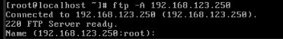

```FTP do Term2 para Term1```

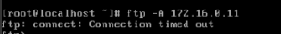

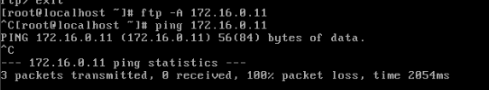


TODO: confirmar
R: O insucesso deve-se ao facto de termos a tradução a ser feita de ```interior``` para ```exterior``` (Term1 -> Term2). Mas no sentido oposto não temos essa tradução, ou seja, do exterior não temos nenhuma entrada na ```tabela NAT``` que faça a tradução de pacotes que vem do exterior para Term1


### b. No router Linux, redireccione (port forwarding) a porta 21 da interface exterior (ens3) para a porta 21 (ftp) do terminal 1. (confRes)

    nft add rule ip nat prerouting iif ens3 tcp dport 21 dnat to 172.16.0.11:21

duvida: mesmo com esta regra (não consigo comunicar com ```Term2 -> Term1```).Precisso de fazer isto para fazer os restantes exercicios
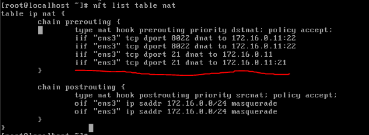

### c. Tente novamente fazer o ftp e transferir um ficheiro. Comente os resultados, referindo o que acontece nas conexões de controlo e de dados. (capRes + texRes)

```Todo: depende da configuração feita na alinea b)```

### d. Tente agora fazer um ftp do terminal 1 para o terminal 2 e fazer download de um ficheiro. Comente os resultados. (capRes + texRes)

```Todo: depende da configuração feita na alinea b)```

### e. No router Linux, faça download do ficheiro ftp-ct.nft (pode usar o wget) e active o suporte para ftp correndo os comandos:

```Todo: depende da configuração feita na alinea b)```

+ modprobe nf_nat_ftp
+ nft -f ftp-ct.nft

NOTA: Pode ver aqui como usar conntrack helpers com nftables.

Tente novamente o ftp da alínea anterior e comente os resultados tendo em conta o que acontece na conexão de controlo e na de dados. (capRes + texRes)