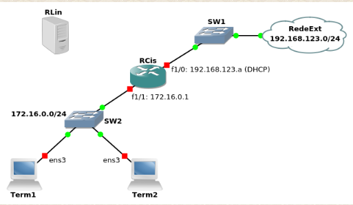

# Trabalho 3 - DHCP e NAT 




**Nota:**

+ Antes de começar, verifique em cada um dos terminais que o ficheiro ```/etc/dhcp/dhclient.conf``` existe e contém a linha  **send dhcp-client-identifier = hardware;**.  Caso contrário, crie-o (numa shell de root) e acrescente essa linha.

**Configurações inicias**
+ ```Terminais``` 

    + Devem ser configurados por DHCP
        
        1. ifconfig (verificar endereços)
        2. dhclient ```interface``` -v

    
    + Devem ter a correr os servidores de SSH (sshd) e de FTP (proftpd)
****
    (em ambos os terminais)
    Por a correr servidores SSH:
        systemctl status sshd
        (caso esteja desligado)
        systemctl start sshd
        systemctl enable sshd 

    Por a correr servidores FTP:

        systemctl status proftpd
        systemctl enable proftpd
        systemctl start proftpd


+ ```Router Cisco (RCis)```

    + A interface externa (f1/0) é configurada por DHCP. Pode ver que endereço lhe foi atribuído usando o comando  sh ip interface brief .


    + A interface interna (f1/1) é configurada estaticamente.

        1. enable 
        2. conf t 
        3. int f1/1 
        4. ip addr 172.16.0.1
        5. no shutdown
        6. copy running-config startup config

    + ```DHCP```

        + Pool de endereços a atribuir dinamicamente: 172.16.0.50 a 172.16.0.150


        + Endereço 172.16.0.11 reservado para o terminal 1

        + Além do endereço IP, deverão ser configurados por DHCP
            + Default gateway
            + Servidor de DNS (usar o 192.168.123.1)
            + Máscara de rede
            + Nome do domínio (usar o alunos.dcc.fc.up.pt)
        
        + Configure a duração das leases, que deverá ser sempre de 1 hora.

        Configuração```RCis```  
            1. enable 
            2. conf t 
            3. ip dhcp excluded-address 172.16.0.1 172.16.0.11
            
            (dynamic é apenas o nome dado a esta pool)
            4. ip dhcp pool dynamic 
                4.1 network 172.16.0.0 255.255.255.0
                4.2 default-router 172.16.0.1
                4.3 dns-server 192.168.123.1
                4.4 domain-name  alunos.dcc.fc.up.pt
                4.5 lease 0 1 0
                4.6 exit
            
            5. ip dhcp pool manual
                5.1 host 172.16.0.11 255.255.255.0

                (verificar o MAC_TERM_1 com ifconfig no Term1 e remover os 00: no inicio)

                (0100:(....) indica que é o client identifier MAC ADDRESS)

                5.2 client-identifier 0100:MAC_TERM_1 
                5.3 client-name Term1
                5.4 lease 0 1 0

            6. Guardar configurações
                6.1copy running-config startup-config

            7. Verificar pool
                7.1 show ip dhcp pool
                7.2 show ip dhcp binding
    
    Configuração ```Term1```
        (remover configuração dhcp de uma dada interface)
        1. sudo dhclient -r interface

        2. dhclient interface -v 

        3. ifconfig 


TODO: FIQUEI AQUI 

    + ```NAT```
    	+ Fazer NAT usando o endereço da interface externa (f1/0) do router e activar overloading (PAT)

        ```Configurações RCis```

            1.

        + Redireccionar (port forwarding) a porta 8022 da interface externa (f1/0) para a porta 22 (ssh) do terminal 1

+ ```Router Linux (a configurar posteriormente)```

    + ```DHCP```
        + Configuração idêntica à que tinha RCis
        + Duração máxima das leases de 2 horas.
        + Sempre que alterar o ficheiro /etc/dhcp/dhcpd.conf, teste esse ficheiro usando  dhcpd -t  antes de (re)iniciar o serviço.
    + ```NAT```
        + Configure as nftables para masquerading, isto é, source NAT usando o endereço (dinâmico) da interface externa. As regras criadas com o comando nftables são temporárias. Para as tornar persistentes, pode usar os seguintes comandos:
****
    nft list table nat > /etc/nftables/myNATtable.nft 
    echo 'include "/etc/nftables/myNATtable.nft"' >> /etc/sysconfig/nftables.conf 
    systemctl enable --now nftables 
****
    
+ + Deve ter a correr o servidor de SSH.
