# Trabalho 2- Encaminhamento dinâmico

**duvida**: porque é que em certos routers nos fazemos o uso de **redistribute** e noutros não?? 

**duvida**: o **redistribute** é necessario no r2 para o funcionamento do ospf?

**NOTAS IMPORTANTES:**

+ **Não pode haver de conflitos de endereços entre subredes presentes num sistema OSPF** ( porque pode causar confusão no reenvio de pacotes)

+ A eleição de um **DR** é feita em cada sub-rede (e.g. [R3,R4,R6,R5] formam uma sub-rede )

+ A eleição de **DR**, **BDR** e **BDROther** é feita em cada sub-rede cada vez que a ligamos (no caso do GNS3, cada vez que clicamos na seta do play) 

## Objetivo
No emulador de rede GNS3 dentro da VM a correr no sistema de virtualização deve configurar a rede da seguinte figura segundo as indicações dadas abaixo:

+ Os **terminais** usam como *default gateway* o **router** da rede à qual estão ligados.

+ No **AS1**, cada **router Rn** deve usar como **ID 1.0.0.n** . No **AS2**, cada **router Rn** deve usar como **ID 2.0.0.n** .

**Duvida: como faco com que as rotas importadas tenham uma métrica de 100**

    redistribute ospf <id> metric 100 subnets (confirmar)

+ O **router R2** pertence a **dois sistemas autónomos**, pelo que **necessitará de dois processos OSPF distintos**. Este **router** deve **redistribuir no AS2** as **rotas aprendidas no AS1** e **vice-versa**. As **rotas importadas** devem ter uma **métrica 100**.

**Nota sobre ponto abaixo:**
     
    Optimizaçoes finais, para evitar tanto trafego na rede (fazer esta configuraçao no R2 e R6)

     summary-address <prefix> <netmask> 
     
    Na configuração do processo OSPF do ASBR,este comando indica que as sub-redes da rede indicada importadas devem ser sumarizadas nessa
    rede para redistribuição
    
+ As **sub-redes 192.168.1.x** devem ser **sumarizadas na rede classful** a que pertencem para **efeitos de redistribuição** (e apenas para este fim)
     

**Nota sobre ponto abaixo:**
     
     Configurar os router, com ligaçoes para os "baloes", como interfaces passivas(sao apenas optimizaçoes para o protocolo OSPF, nao sao obrigatorias)

    No respetivo router, e no respetivo proceso ospf:

    passive-interface <interface>:
    Impede o envio de mensagens RIP na interface indicada;
    contudo, a rede dessa interface continua a incluir-se em anúncios enviados noutras interfaces, e mensagens RIP recebidas nessa interface continuam a ser processadas normalmente.

+ **Não devem ser enviadas mensagens de encaminhamento nas interfaces às quais não está ligado nenhum outro router (incluindo as ligadas aos terminais)**

+ As **métricas do OSPF** devem ser **calculadas automaticamente**. Deve mudar a **largura de banda de referência** de modo a que seja atribuído o **custo 10 a cada ligação FastEthernet**.

## Notas 

+ Os **routers** utilizados na simulação **são modulares**, da série 7200. A **ligação** entre **R6** e **R8** é feita através de **portas série síncronas** (**todas as outras ligações são FastEthernet**).

+ Se deixar o ponteiro do rato parado em cima de uma ligação, aparece um balão de informação indicando os routers que interliga, bem como as respectivas portas. Pode, assim, identificar que interfaces correspondem a cada ligação.

+ Para tornar a emulação mais leve, os **terminais 1 e 2 são emulados (VPCS)**. Para **configurar o endereço IP, máscara de rede e default gateway**, usar o **comando ip ipaddr/preflen gateway** (e.g., ip 192.168.1.123/25 192.168.1.1). Depois **guarde a configuração com o comando save**.

## Configurações iniciais

**Para descobrir a mascara de um prefixo /x usar:**

+   *ipcalc -m 0.0.0.0/x*

**Nota**

✅ -> configuração correta
⚠️ -> verificar configuração com professor (pode também ser uma duvida ou ambos)

### Term 1 ✅

    1. ip 192.168.1.123/25 192.168.1.1
    2. save

### Term 2 ✅

    1. ip 172.16.1.2/24 172.16.1.1 
    2. save

### R1 ⚠️

    0. Configurar hostname ✅
        0.1 enable
        0.2 cof t 
        0.3 hostname R1

    1. Configurar endereço interface f1/0 ✅
        1.1. enable 
        1.2. conf t
        1.3. int f1/0
        1.4. ip addr 192.168.1.1 255.255.255.128
        1.5. no shutdown
        1.6. exit
    2. Configurar endereço interface f1/1 ✅
        2.1. enable
        2.2. conf t
        2.3. int f1/1
        2.4. ip addr 192.168.1.129 255.255.255.192
        2.5. no shutdown
        2.6. end 
    3. Confirmar configurações
        3.1 show ip int brief 

    4. Definir router id (AS1, cada router Rn deve usar como ID 1.0.0.n) 
        4.1 enable
        4.2 conf t 
        4.3 router ospf 1
        4.4 router-id 1.0.0.1

**Nota: Como todas as interfaces deste router pertencem a mesma area OSPF, podemos simplesmente fazer** *network 0.0.0.0 255.255.255.255 area 0* 

    5. Definir quais interfaces fazem  parte do OSPF e associar custo  ⚠️
        5.1 enable 
        5.2 conf t 
        5.3 router ospf 1 

        
        (custo =Deve mudar a largura de banda de referência de modo a que seja atribuído o custo 10 a cada ligação FastEthernet. )
        5.4 auto-cost reference-bandwidth 1000
        
        (site para descobrir wildcard: https://jodies.de/ipcalc?host=0.0.0.0&mask1=24&mask2=)

        5.5 network 192.168.1.0  0.0.0.127  area 0
        5.6 network 192.168.1.128 0.0.0.63  area 0
        5.7 end
    6. Demonstração de informação OSPF
        6.1 enable 
        6.2 show ip ospf database 

        6.3 show ip ospf interface brief

        6.4  show ip ospf neighbor

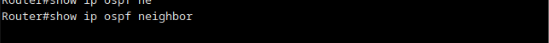 

    7. Guardar configuração
        7.1 copy running-config startup-config

### R2 ⚠️

    0. Configurar hostname ✅
        0.1 enable
        0.2 cof t 
        0.3 hostname R2

    1. Configurar endereço interface f1/0 ✅
        1.1 enable
        1.2 conf t 
        1.3 int f1/0
        1.4 ip addr 192.168.1.193 255.255.255.192
        1.5 no shutdown
        1.6 exit
    2. Configurar endereço interface f1/1 ✅
        1.1 enable
        2.2 conf t 
        2.3 int f1/1
        2.4 ip addr 192.168.1.130 255.255.255.192
        2.5 no shutdown 
        2.6 exit
    3. Configurar endereço interface f2/0 ✅
        3.1 enable
        3.2 conf t 
        3.3 int f2/0
        3.4 ip addr 192.168.50.1 255.255.255.0
        3.5 no shutdown
        3.6 exit

    4. Configurar interface OSPF da esquerda (id = 1) e custo  
        (AS1, cada router Rn deve usar como ID 1.0.0.n)
        4.1 router ospf 1
        4.2 router-id 1.0.0.2

        (não executei os comandos 4.3 a 4.5, verificar se estao corretos) 
        4.3 auto-cost reference-bandwidth 1000

        (4.4 e 4.5  <=> network 192.168.1.0 0.0.0.255 area 0)
        4.4 network 192.168.1.192  0.0.0.63 area 0 ⚠️
        4.5 network 192.168.1.128 0.0.0.63  area 0 ⚠️

**redistribute ospf <pid> Activa a redistribuição pelo RIP das rotas aprendidas através da instância <pid> do protocolo OSPF**

        4.6 redistribute ospf 2 metric 100 subnets ⚠️ (PEDIR PARA EXPLICAR ISTO, NÃO BASTAVA O NETWORK??)

        (Não devem ser enviadas mensagens de encaminhamento nas interfaces às quais não está ligado nenhum outro router (f1/0))
        4.7 passive-interface FastEthernet1/0 ✅
        
        4.8 end

    
    5. Configurar interface OSPF da direita (id = 2) e custo  ✅
        (No AS2, cada router Rn deve usar como ID 2.0.0.n)
        5.1 router ospf 2
        5.2 router-id 2.0.0.2

        5.3 auto-cost reference-bandwidth 1000 
        5.4 network 192.168.50.0  0.0.0.255 area 0 

**redistribute ospf <pid> Activa a redistribuição pelo RIP das rotas aprendidas através da instância <pid> do protocolo OSPF**

        5.5 redistribute ospf 1 metric 100 subnets ⚠️ (PEDIR PARA EXPLICAR ISTO, NÃO BASTAVA O NETWORK??)
        5.6 end

    6. As sub-redes 192.168.1.x devem ser sumarizadas na rede classful ✅
        6.1 router ospf 2
        6.1 summary-address 192.168.1.0 255.255.255.0

    7. Demonstração de informação OSPF
        7.1 enable 
        7.2 show ip ospf database 

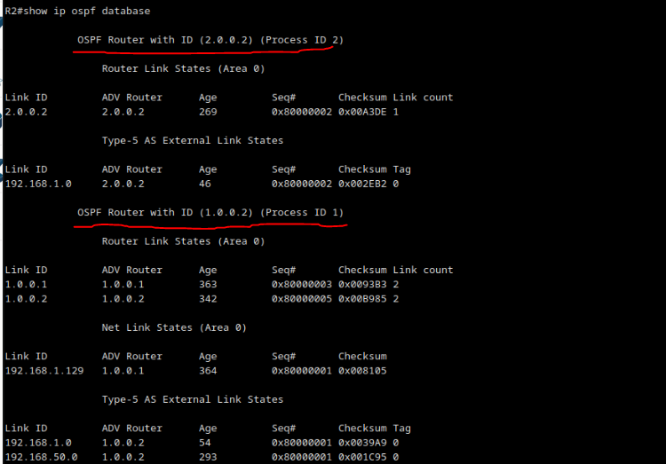

        7.3 show ip ospf interface brief

        7.4 show ip ospf neighbor

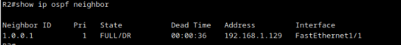
    8. Guardar configuração
        8.1 copy running-config startup-config

### R3 ⚠️
    0. Configurar hostname ✅
        0.1 enable
        0.2 cof t 
        0.3 hostname R3

    1. Configurar endereço interface f1/0 ✅
        1.1 enable
        1.2 conf t 
        1.3 int f1/0
        1.4 ip addr 192.168.60.1 255.255.255.0
        1.5 no shutdown
        1.6 exit
    2. Configurar endereço interface f2/0 (mascara é /24 por ser rede classe C) ✅
        2.1 enable
        2.2 conf t 
        2.3 int f2/0
        2.4 ip addr 192.168.100.1 255.255.255.0
        2.5 no shutdown
        2.6 exit
    3. Configurar endereço interface f1/1 ✅
        3.1 enable
        3.2 conf t 
        3.3 int f1/1
        3.4 ip addr 192.168.50.2 255.255.255.0
        3.5 no shutdown
        3.6 exit
    4. Confirmar configurações
        4.1 show ip int brief 

    5. Definir router id (No AS2, cada router Rn deve usar como ID 2.0.0.n)
        5.1 router ospf 1
        5.2 router-id 2.0.0.3
    
    6. Definir quais interfaces fazem  parte do OSPF e associar custo 
        6.1 enable 
        6.2 conf t 
        6.3 router ospf 1 
        
        (custo =Deve mudar a largura de banda de referência de modo a que seja atribuído o custo 10 a cada ligação FastEthernet. )
        6.4 auto-cost reference-bandwidth 1000 
        
        (site para descobrir wildcard: https://jodies.de/ipcalc?host=0.0.0.0&mask1=24&mask2=)

        (<=> network 0.0.0.0 255.255.255.255 area 0, porque todas as interfaces pertencem ao mesmo ospf)
         
        6.5 network 192.168.50.0  0.0.0.255  area 0 ⚠️
        6.6 network 192.168.60.0  0.0.0.255  area 0 ⚠️
        6.7 network 192.168.100.0  0.0.0.255  area 0 ⚠️

        (Não devem ser enviadas mensagens de encaminhamento nas interfaces às quais não está ligado nenhum outro router (f1/0))
        6.8 passive-interface FastEthernet1/0 ⚠️
        6.9 end 

    7. Demonstração de informação OSPF
        7.1 enable 
        7.2 show ip ospf database 

        7.3 show ip ospf interface brief

        7.4 show ip ospf neighbor

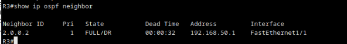

    8. Guardar configuração
        8.1 copy running-config startup-config

### R4 ✅
    0. Configurar hostname ✅
        0.1 enable
        0.2 cof t 
        0.3 hostname R4
    1. Configurar endereço interface f1/0 ✅
        1.1 enable
        1.2 conf t 
        1.3 int f1/0 (mascara é /24 por ser rede classe C)
        1.4 ip addr 192.168.100.253 255.255.255.0
        1.5 no shutdown
        1.6 exit
    2. Confirmar configurações
        2.1 show ip int brief 

    3. Definir router id (No AS2, cada router Rn deve usar como ID 2.0.0.n)  ✅
        3.1 router ospf 1
        3.2 router-id 2.0.0.4

    4. Definir quais interfaces fazem  parte do OSPF e associar custo  ✅
        4.1 enable 
        4.2 conf t 
        4.3 router ospf 1 
     
        
        (custo =Deve mudar a largura de banda de referência de modo a que seja atribuído o custo 10 a cada ligação FastEthernet. )
        4.4 auto-cost reference-bandwidth 1000 
        
        (site para descobrir wildcard: https://jodies.de/ipcalc?host=0.0.0.0&mask1=24&mask2=)
        4.5 network 192.168.100.0  0.0.0.255  area 0
        4.6 end
    
    5. Demonstração de informação OSPF
        5.1 enable 
        5.2 show ip ospf database 

        5.3 show ip ospf interface brief

        5.4 show ip ospf neighbor

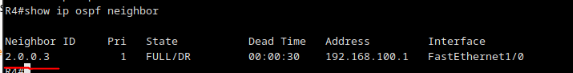

    6. Guardar configuração
        6.1 copy running-config startup-config

### R5  ✅
    0. Configurar hostname ✅
        0.1 enable
        0.2 cof t 
        0.3 hostname R5
    1. Configurar endereço interface f1/0 ✅
        1.1 enable
        1.2 conf t 
        1.3 int f1/0 (mascara é /24 por ser rede classe C)
        1.4 ip addr 192.168.100.254 255.255.255.0 
        1.5 no shutdown
        1.6 exit
    2. Confirmar configurações
        2.1 show ip int brief 

    3. Definir router id (No AS2, cada router Rn deve usar como ID 2.0.0.n) ✅
        3.1 router ospf 1
        3.2 router-id 2.0.0.5

    4. Definir quais interfaces fazem  parte do OSPF e associar custo  ✅
        4.1 enable 
        4.2 conf t 
        4.3 router ospf 1 
     
        
        (custo =Deve mudar a largura de banda de referência de modo a que seja atribuído o custo 10 a cada ligação FastEthernet. )
        4.4 auto-cost reference-bandwidth 1000 
        
        (site para descobrir wildcard: https://jodies.de/ipcalc?host=0.0.0.0&mask1=24&mask2=)
        4.5 network 192.168.100.0  0.0.0.255  area 0
        4.6 end

    5. Demonstração de informação OSPF
        5.1 enable 
        5.2 show ip ospf database 

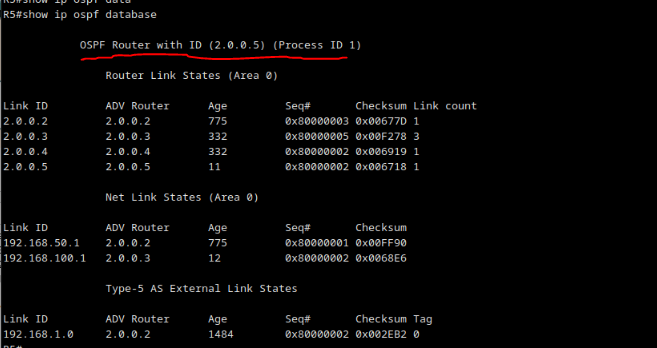

        5.3 show ip ospf interface brief

        5.4 show ip ospf neighbor

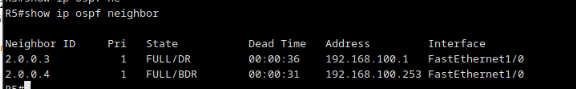

    6. Guardar configuração
        6.1 copy running-config startup-config

 

>R: (**mascara /30** não pode ser /31 porque so deixa 2 endereços e esses endereços ja estão reservados, ver explicação no moodle)
> ver apontomentos que tenho sobre o video "Determinar comprimentos de prefixo"

### R6  ⚠️

**duvida**: porque é que aqui não usamos network e usamos ip ospf <id> area <numero_area>? 

**duvida**: porque é que aqui so basta uma instancia ospf? (penso que se deve ao facto que não estamos a definir o ospf com network mas sim por interface com o comando ip ospf <id> area <numero_area> mas confirmar)

    0. Configurar hostname ✅
        0.1 enable
        0.2 cof t 
        0.3 hostname R6
    1. Configurar endereço interface f1/1 e ospf ✅
        1.1 enable
        1.2 conf t 
        1.3 int f1/1 ( mascara de rede é /30)
        1.4 ip addr 172.20.1.1 255.255.255.252 (TODO confirmar esta configuracao)

        (configura ospf com id 1 e respetiva area nesta interface)
        1.5 ip ospf 1 area 1

        1.6 no shutdown
        1.7 exit
    2. Configurar endereço s2/0 e ospf ✅
        2.1 enable 
        2.2 conf t
        2.3 int s2/0 
        2.4 ip addr 172.20.1.14 255.255.255.252  (TODO confirmar esta configuracao)

        (configura ospf com id 1 e respetiva area nesta interface)
        2.5 ip ospf 1 area 2

        2.6 no shutdown
        2.7 exit

    3. Configurar endereço interface f1/0 e  ospf ✅
        3.1 enable
        3.2 conf t 
        3.3 int f1/0 (mascara é /24 por ser rede classe C)
        3.4 ip addr 192.168.100.2 255.255.255.0 

        (configura ospf com id 1 e respetiva area nesta interface)
        3.5 ip ospf 1 area 0

        3.6 no shutdown
        3.7 exit

    4. Confirmar configurações
        4.1 show ip int brief 

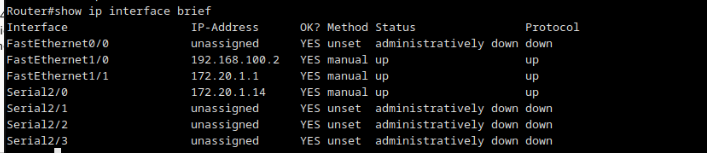
 
    5 definicao ospf ✅
        5.1 router ospf 1
        5.2 router-id 2.0.0.6
        5.3 auto-cost reference-bandwidth 1000 

    5. Demonstração de informação OSPF
        5.1 enable 
        5.2 show ip ospf database 

        5.3 show ip ospf interface brief

        5.4 show ip ospf neighbor

    6. Guardar configuração
        6.1 copy running-config startup-config

### R7 ⚠️

    0. Configurar hostname ✅
        0.1 enable
        0.2 cof t 
        0.3 hostname R7

    1. Configurar endereço interface f1/0 ✅
        1.1 enable
        1.2 conf t 
        1.3 int f1/0 ( mascara de rede é /30)
        1.4 ip addr 172.20.1.2 255.255.255.252
        1.5 no shutdown
        1.6 exit
        
    2. Configurar endereço interface f1/1 ✅
        2.1 enable
        2.2 conf t 
        2.3 int f1/1 ( mascara de rede é /30)
        2.4 ip addr 172.20.1.5 255.255.255.252 
        2.5 no shutdown
        2.6 exit

    3. Configurar endereço interface f2/0 ✅
        3.1 enable
        3.2 conf t 
        3.3 int f2/0 
        3.4 ip addr 172.16.1.1 255.255.255.0 
        3.5 no shutdown
        3.6 exit

    4. Confirmar configurações
        4.1 show ip int brief 

    5. Definir router id (No AS2, cada router Rn deve usar como ID 2.0.0.n)
        5.1 router ospf 1
        5.2 router-id 2.0.0.7

    4. Definir quais interfaces fazem  parte do OSPF e associar custo 
        4.1 enable 
        4.2 conf t 
        4.3 router ospf 1 
     
        
        (custo =Deve mudar a largura de banda de referência de modo a que seja atribuído o custo 10 a cada ligação FastEthernet. )
        4.4 auto-cost reference-bandwidth 1000 
        
        (site para descobrir wildcard: https://jodies.de/ipcalc?host=0.0.0.0&mask1=24&mask2=)

        (4.5 , 4.6 e 4.7 <=> network 0.0.0.0 255.255.255.255 area 1 , porque todas as interfacespertencem ao mesmo ospf )
        4.5 network 172.16.1.0  0.0.0.255  area 1  ⚠️
        4.6 network 172.20.1.0 0.0.0.3 area 1 ⚠️
        4.7 network  172.20.1.4 0.0.0.3 area 1  ⚠️
        4.8 end

    5. Demonstração de informação OSPF
        5.1 enable 
        5.2 show ip ospf database 

        5.3 show ip ospf interface brief

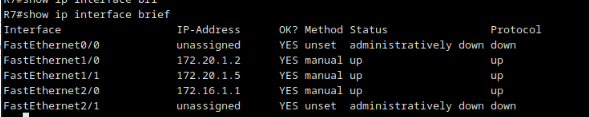

        5.4 show ip ospf neighbor

    6. Guardar configuração
        6.1 copy running-config startup-config

### R8 ✅

    0. Configurar hostname ✅
        0.1 enable
        0.2 cof t 
        0.3 hostname R8

    1. Configurar endereço interface f1/0 ✅
        1.1 enable
        1.2 conf t 
        1.3 int f1/0 ( mascara de rede é /30)
        1.4 ip addr 172.18.1.1 255.255.255.0 
        1.5 no shutdown
        1.6 exit
        
    2. Configurar endereço interface f1/1 ✅
        2.1 enable
        2.2 conf t 
        2.3 int f1/1 ( mascara de rede é /30)
        2.4 ip addr  172.20.1.10 255.255.255.252 
        2.5 no shutdown
        2.6 exit

    3. Configurar endereço s2/0 ✅
        3.1 enable
        3.2 conf t
        3.3 int s2/0 
        3.4 ip addr 172.20.1.13 255.255.255.252 
        3.5 no shutdown
        3.6 exit

    4. Confirmar configurações
        4.1 show ip int brief 

    5. Definir router id (No AS2, cada router Rn deve usar como ID 2.0.0.n) ✅
        5.1 router ospf 1
        5.2 router-id 2.0.0.8

    6. Definir quais interfaces fazem  parte do OSPF e associar custo 
        6.1 enable 
        6.2 conf t 
        6.3 router ospf 1 
     
        
        (custo =Deve mudar a largura de banda de referência de modo a que seja atribuído o custo 10 a cada ligação FastEthernet. )
        6.4 auto-cost reference-bandwidth 1000 
        
        
        (site para descobrir wildcard: https://jodies.de/ipcalc?host=0.0.0.0&mask1=24&mask2=)

         (6.5, 6.6 e 6.7 <=> network 0.0.0.0 255.255.255.255 area 2 porque todas as interfaces de R8 estão na mesma area)
        6.5 network 172.18.1.0  0.0.0.255  area 2 ⚠️
        6.6  network 172.20.1.12 0.0.0.3 area 2 ⚠️
        6.7 network 172.20.1.8 0.0.0.3 area 2 ⚠️

        
        (Não devem ser enviadas mensagens de encaminhamento nas interfaces às quais não está ligado nenhum outro router (f1/0))
        6.8 passive-interface FastEthernet1/0 ✅
        6.9 end

    7. Demonstração de informação OSPF
        7.1 enable 
        7.2 show ip ospf database 

        7.3 show ip ospf interface brief

        7.4 show ip ospf neighbor

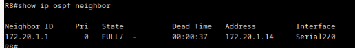

    8. Guardar configuração
        8.1 copy running-config startup-config

### R9 

**duvida**: porque que aqui nos usamos apenas uma instancia ospf e no R2 usamos 2? (eu penso que se deva ao facto de R2 estar em duas area 0 *backbone* distintas, enquanto que outros routers como o caso de R6 e R9 podem ter interfaces em diferentes areas, mas nenhuma delas é area 0 *backbone*)

    0. Configurar hostname ✅
        0.1 enable
        0.2 cof t 
        0.3 hostname R9

    1. Configurar endereço interface f1/0 ✅
        1.1 enable
        1.2 conf t 
        1.3 int f1/0 ( mascara de rede é /30)
        1.4 ip addr 172.20.1.6 255.255.255.252 
        1.5 no shutdown
        1.6 exit
        
    2. Configurar endereço interface f1/1 ✅
        2.1 enable
        2.2 conf t 
        2.3 int f1/1 ( mascara de rede é /30)
        2.4 ip addr 172.20.1.9 255.255.255.252 
        2.5 no shutdown
        2.6 exit

    3. Configurar endereço interface f2/0 ✅
        3.1 enable
        3.2 conf t 
        3.3 int f2/0 
        3.4 ip addr 172.17.0.1 255.255.0.0 
        3.5 no shutdown
        3.6 exit

    4. Confirmar configurações
        4.1 show ip int brief 

    5. Configurar interface OSPF da zona roza (id = 1) , custo e router id
        5.1 enable 
        5.2 conf t 
        5.3 router ospf 1 
        5.4 router-id 2.0.0.9
     
        (custo =Deve mudar a largura de banda de referência de modo a que seja atribuído o custo 10 a cada ligação FastEthernet. )
        5.5 auto-cost reference-bandwidth 1000 
        
        (site para descobrir wildcard: https://jodies.de/ipcalc?host=0.0.0.0&mask1=24&mask2=)
        5.6 network 172.20.1.8  0.0.0.3 area 2
        5.7 network 172.17.0.0  0.0.255.255 area 2
        5.8 network 172.20.1.4 0.0.0.3 area 1

       (Não devem ser enviadas mensagens de encaminhamento nas interfaces às quais não está ligado nenhum outro router (f2/0))
        5.9 passive-interface FastEthernet2/0

        5.10 end

    6. Demonstração de informação OSPF
        6.1 enable 
        6.2 show ip ospf database 

        6.3 show ip ospf interface brief

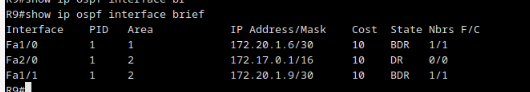

        6.4 show ip ospf neighbor

    7. Guardar configuração
        7.1 copy running-config startup-config

### Testar conectividade 

**Nota**: testei na maioria das interfaces e funciona

Para testar a conectividade temos de:

+ Fazer ping dos terminais para cada uma das interfaces do router
+ Se algum der problemas devemos ir a esse mesmo router e verificar a b.d do ospf correspondente

