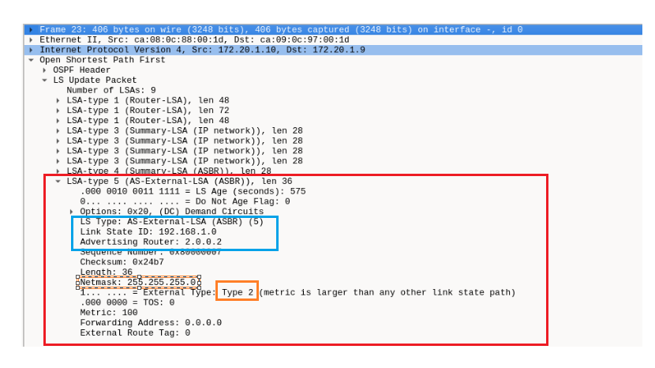

# Trabalho 2- Encaminhamento dinâmico

**NOTAS IMPORTANTES:**

+ **Não pode haver de conflitos de endereços entre subredes presentes num sistema OSPF** ( porque pode causar confusão no reenvio de pacotes)

+ A eleição de um **DR** é feita em cada sub-rede (e.g. [R3,R4,R6,R5] formam uma sub-rede )

+ A eleição de **DR**, **BDR** e **BDROther** é feita em cada sub-rede cada vez que a ligamos (no caso do GNS3, cada vez que clicamos na seta do play) 

+ AS CONFIGURACOES MOSTRADOS NAS SCREENSHOTS PODE TER INFORMACAO INCORRETA NO QUE TORNA A OSPF, PORQUE AS CONFIGURAÇÕES FORAM FEITAS EM DIFERENTES "SESSOES", O QUE LEVA A QUE OS "PROCESSOS DE ELEICAO DR e BDR" ASSOCIADOS AOS ROUTER PODEM TER SIDO DIFERENTES.
 

## Objetivo
No emulador de rede GNS3 dentro da VM a correr no sistema de virtualização deve configurar a rede da seguinte figura segundo as indicações dadas abaixo:

+ Os **terminais** usam como *default gateway* o **router** da rede à qual estão ligados.

+ No **AS1**, cada **router Rn** deve usar como **ID 1.0.0.n** . No **AS2**, cada **router Rn** deve usar como **ID 2.0.0.n** .

**Duvida: como faco com que as rotas importadas tenham uma métrica de 100**

+ O **router R2** pertence a **dois sistemas autónomos**, pelo que **necessitará de dois processos OSPF distintos**. Este **router** deve **redistribuir no AS2** as **rotas aprendidas no AS1** e **vice-versa**. As **rotas importadas** devem ter uma **métrica 100**.

**Nota sobre ponto abaixo:**
     
     Optimizaçoes finais, para evitar tanto trafego na rede (fazer esta configuraçao no R2 e R6)
    
+ As **sub-redes 192.168.1.x** devem ser **sumarizadas na rede classful** a que pertencem para **efeitos de redistribuição** (e apenas para este fim)
     

**Nota sobre ponto abaixo:**
     
     Configurar os router, com ligaçoes para os "baloes", como interfaces passivas(sao apenas optimizaçoes para o protocolo OSPF, nao sao obrigatorias)

+ **Não devem ser enviadas mensagens de encaminhamento nas interfaces às quais não está ligado nenhum outro router (incluindo as ligadas aos terminais)**

+ As **métricas do OSPF** devem ser **calculadas automaticamente**. Deve mudar a **largura de banda de referência** de modo a que seja atribuído o **custo 10 a cada ligação FastEthernet**.

## Notas 

+ Os **routers** utilizados na simulação **são modulares**, da série 7200. A **ligação** entre **R6** e **R8** é feita através de **portas série síncronas** (**todas as outras ligações são FastEthernet**).

+ Se deixar o ponteiro do rato parado em cima de uma ligação, aparece um balão de informação indicando os routers que interliga, bem como as respectivas portas. Pode, assim, identificar que interfaces correspondem a cada ligação.

+ Para tornar a emulação mais leve, os **terminais 1 e 2 são emulados (VPCS)**. Para **configurar o endereço IP, máscara de rede e default gateway**, usar o **comando ip ipaddr/preflen gateway** (e.g., ip 192.168.1.123/25 192.168.1.1). Depois **guarde a configuração com o comando save**.

## Configurações iniciais

**Para descobrir a mascara de um prefixo /x usar:**

+   *ipcalc -m 0.0.0.0/x*

### Term 1

    1. ip 192.168.1.123/25 192.168.1.1
    2. save

### Term 2

    1. ip 172.16.1.2/24 172.16.1.1 
    2. save

### R1
    1. Configurar endereço interface f1/0
        1.1. enable 
        1.2. conf t
        1.3. int f1/0
        1.4. ip addr 192.168.1.1 255.255.255.128
        1.5. no shutdown
        1.6. exit
    2. Configurar endereço interface f1/1
        2.1. enable
        2.2. conf t
        2.3. int f1/1
        2.4. ip addr 192.168.1.129 255.255.255.192
        2.5. no shutdown
        2.6. end 
    3. Confirmar configurações
        3.1 show ip int brief 

    4. Definir router id (AS1, cada router Rn deve usar como ID 1.0.0.n)
        4.1 enable
        4.2 conf t 
        4.3 router opsf 1
        4.4 router-id 1.0.0.1
    5. Definir quais interfaces fazem  parte do OSPF e associar custo 
        5.1 enable 
        5.2 conf t 
        5.3 router ospf 1 

        
        (custo =Deve mudar a largura de banda de referência de modo a que seja atribuído o custo 10 a cada ligação FastEthernet. )
        5.4 auto-cost reference-bandwidth 10000
        
        (site para descobrir wildcard: https://jodies.de/ipcalc?host=0.0.0.0&mask1=24&mask2=)

        5.5 network 192.168.1.0  0.0.0.127  area 0
        5.6 network 192.168.1.128 0.0.0.63  area 0
        5.7 end
    6. Demonstração de informação OSPF
        6.1 enable 
        6.2 show ip ospf database 

        6.3 show ip ospf interface brief

        6.4  show ip ospf neighbor

 

    7. Guardar configuração
        7.1 copy running-config startup-config

### R2 

    1. Configurar endereço interface f1/0
        1.1 enable
        1.2 conf t 
        1.3 int f1/0
        1.4 ip addr 192.168.1.193 255.255.255.192
        1.5 no shutdown
        1.6 exit
    2. Configurar endereço interface f1/1
        1.1 enable
        2.2 conf t 
        2.3 int f1/1
        2.4 ip addr 192.168.1.130 255.255.255.192
        2.5 no shutdown 
        2.6 exit
    3. Configurar endereço interface f2/0
        3.1 enable
        3.2 conf t 
        3.3 int f2/0
        3.4 ip addr 192.168.50.1 255.255.255.0
        3.5 no shutdown
        3.6 exit

    4. Configurar interface OSPF da esquerda (id = 1) e custo 
        (AS1, cada router Rn deve usar como ID 1.0.0.n)
        4.1 router opsf 1
        4.2 router-id 1.0.0.2

        (não executei os comandos 4.3 a 4.5, verificar se estao corretos) 
        4.3 auto-cost reference-bandwidth 10000

        4.4: network 192.168.1.192  0.0.0.63 area 0
        4.5: network 192.168.1.128 0.0.0.63  area 0
        4.6 end
    5. Configurar interface OSPF da direita (id = 2) e custo 
        (No AS2, cada router Rn deve usar como ID 2.0.0.n)
        5.1 router opsf 2
        5.2 router-id 2.0.0.2

        5.3 auto-cost reference-bandwidth 10000 
        5.4 network 192.168.50.0  0.0.0.255 area 0
        5.4 end
    6. Demonstração de informação OSPF
        6.1 enable 
        6.2 show ip ospf database 

        6.3 show ip ospf interface brief

        6.4 show ip ospf neighbor

    7. Guardar configuração
        7.1 copy running-config startup-config

### R3
    1. Configurar endereço interface f1/0
        1.1 enable
        1.2 conf t 
        1.3 int f1/0
        1.4 ip addr 192.168.60.1 255.255.255.0
        1.5 no shutdown
        1.6 exit
    2. Configurar endereço interface f2/0 (mascara é /24 por ser rede classe C)
        2.1 enable
        2.2 conf t 
        2.3 int f2/0
        2.4 ip addr 192.168.100.1 255.255.255.0
        2.5 no shutdown
        2.6 exit
    3. Configurar endereço interface f1/1
        3.1 enable
        3.2 conf t 
        3.3 int f1/1
        3.4 ip addr 192.168.50.2 255.255.255.0
        3.5 no shutdown
        3.6 exit
    4. Confirmar configurações
        4.1 show ip int brief 

    5. Definir router id (No AS2, cada router Rn deve usar como ID 2.0.0.n)
        5.1 router opsf 1
        5.2 router-id 2.0.0.3
    
    6. Definir quais interfaces fazem  parte do OSPF e associar custo 
        6.1 enable 
        6.2 conf t 
        6.3 router ospf 1 
        
        (custo =Deve mudar a largura de banda de referência de modo a que seja atribuído o custo 10 a cada ligação FastEthernet. )
        6.4 auto-cost reference-bandwidth 10000 
        
        (site para descobrir wildcard: https://jodies.de/ipcalc?host=0.0.0.0&mask1=24&mask2=)

        6.5 network 192.168.50.0  0.0.0.255  area 0
        6.6 network 192.168.60.0  0.0.0.255  area 0
        6.7 network 192.168.100.0  0.0.0.255  area 0
        6.8 end 

    7. Demonstração de informação OSPF
        7.1 enable 
        7.2 show ip ospf database 

        7.3 show ip ospf interface brief

        7.4 show ip ospf neighbor

    8. Guardar configuração
        8.1 copy running-config startup-config

### R4 (verificar esta configuração) 
    1. Configurar endereço interface f1/0
        1.1 enable
        1.2 conf t 
        1.3 int f1/0 (mascara é /24 por ser rede classe C)
        1.4 ip addr 192.168.100.253 255.255.255.0
        1.5 no shutdown
        1.6 exit
    2. Confirmar configurações
        2.1 show ip int brief 

    3. Definir router id (No AS2, cada router Rn deve usar como ID 2.0.0.n)
        3.1 router opsf 1
        3.2 router-id 2.0.0.4

    4. Definir quais interfaces fazem  parte do OSPF e associar custo 
        4.1 enable 
        4.2 conf t 
        4.3 router ospf 1 
     
        
        (custo =Deve mudar a largura de banda de referência de modo a que seja atribuído o custo 10 a cada ligação FastEthernet. )
        4.4 auto-cost reference-bandwidth 10000 
        
        (site para descobrir wildcard: https://jodies.de/ipcalc?host=0.0.0.0&mask1=24&mask2=)
        4.5 network 192.168.100.0  0.0.0.255  area 0
        4.6 end
    
    5. Demonstração de informação OSPF
        5.1 enable 
        5.2 show ip ospf database 

        5.3 show ip ospf interface brief

        5.4 show ip ospf neighbor

    6. Guardar configuração
        6.1 copy running-config startup-config

### R5 (verificar esta configuração)
    1. Configurar endereço interface f1/0
        1.1 enable
        1.2 conf t 
        1.3 int f1/0 (mascara é /24 por ser rede classe C)
        1.4 ip addr 192.168.100.254 255.255.255.0 
        1.5 no shutdown
        1.6 exit
    2. Confirmar configurações
        2.1 show ip int brief 

    3. Definir router id (No AS2, cada router Rn deve usar como ID 2.0.0.n)
        3.1 router opsf 1
        3.2 router-id 2.0.0.5

    4. Definir quais interfaces fazem  parte do OSPF e associar custo 
        4.1 enable 
        4.2 conf t 
        4.3 router ospf 1 
     
        
        (custo =Deve mudar a largura de banda de referência de modo a que seja atribuído o custo 10 a cada ligação FastEthernet. )
        4.4 auto-cost reference-bandwidth 10000 
        
        (site para descobrir wildcard: https://jodies.de/ipcalc?host=0.0.0.0&mask1=24&mask2=)
        4.5 network 192.168.100.0  0.0.0.255  area 0
        4.6 end

    5. Demonstração de informação OSPF
        5.1 enable 
        5.2 show ip ospf database 

        5.3 show ip ospf interface brief

        5.4 show ip ospf neighbor

    6. Guardar configuração
        6.1 copy running-config startup-config

 

>(**mascara /30** não pode ser /31 porque so deixa 2 endereços e esses endereços ja estão reservados, ver explicação no moodle)
> ver apontomentos que tenho sobre o video "Determinar comprimentos de prefixo"

### R6 (verificar esta configuração) - TODO confirmar 

    1. Configurar endereço interface f1/1
        1.1 enable
        1.2 conf t 
        1.3 int f1/1 ( mascara de rede é /30)
        1.4 ip addr 172.20.1.1 255.255.255.252 (TODO confirmar esta configuracao)
        1.5 no shutdown
        1.6 exit
    2. Configurar endereço s2/0 (TODO - confirmar esta configuração)
        2.1 enable
        2.2 conf t
        2.3 int s2/0 
        2.4 ip addr 172.20.1.14 255.255.255.252  (TODO confirmar esta configuracao)
        2.5 no shutdown
        2.6 exit
    3. Configurar endereço interface f1/0
        3.1 enable
        3.2 conf t 
        3.3 int f1/0 (mascara é /24 por ser rede classe C)
        3.4 ip addr 192.168.100.2 255.255.255.0 
        3.5 no shutdown
        3.6 exit

    4. Confirmar configurações
        4.1 show ip int brief 

    5. Configurar interface OSPF da esquerda (id = 1) , custo e router id
        5.1 enable 
        5.2 conf t 
        5.3 router ospf 1 
        5.4 router-id 2.0.0.6
     
        (custo =Deve mudar a largura de banda de referência de modo a que seja atribuído o custo 10 a cada ligação FastEthernet. )
        5.5 auto-cost reference-bandwidth 10000 
        
        (site para descobrir wildcard: https://jodies.de/ipcalc?host=0.0.0.0&mask1=24&mask2=)
        5.6 network 192.168.100.0  0.0.0.255  area 0
        5.7 end

    6. Configurar interface OSPF superior direita (id = 2) , custo e router id
        6.1 enable 
        6.2 conf t 
        6.3 router ospf 2 
        6.4 router-id 0.0.2.6  (TODO confirmar esta configuracao)
                
        (custo =Deve mudar a largura de banda de referência de modo a que seja atribuído o custo 10 a cada ligação FastEthernet. )
        6.5 auto-cost reference-bandwidth 10000 

        (determinei a rede com comando ipcalc -n 170.20.1.14/30)
        6.6 (TODO - confirmar esta configuração) network 170.20.1.12 0.0.0.3  area 2 
        6.7 end 

    7. Configurar interface OSPF inferior direita (id = 3) , custo e router id
        7.1 enable 
        7.2 conf t 
        7.3 router ospf 3
        7.4 router-id 0.0.1.6  (TODO confirmar esta configuracao)
                
        (custo =Deve mudar a largura de banda de referência de modo a que seja atribuído o custo 10 a cada ligação FastEthernet. )
        7.5 auto-cost reference-bandwidth 10000 

        (determinei a rede com comando ipcalc -n 170.20.1.1/30)
        7.6 (TODO - confirmar esta configuração) network 170.20.1.0 0.0.0.3  area 1
        7.7 end 

    8. Demonstração de informação OSPF
        8.1 enable 
        8.2 show ip ospf database 

        8.3 show ip ospf interface brief

        8.4 (TODO- colocar screenshot quando tiver configurado)show ip ospf neighbor

    9. Guardar configuração
        9.1 copy running-config startup-config

### R7 (verificar esta configuração) - TODO confirmar

    1. Configurar endereço interface f1/0
        1.1 enable
        1.2 conf t 
        1.3 int f1/0 ( mascara de rede é /30)
        1.4 ip addr 172.20.1.2 255.255.255.252 (TODO confirmar esta configuracao)
        1.5 no shutdown
        1.6 exit
        
    2. Configurar endereço interface f1/1
        2.1 enable
        2.2 conf t 
        2.3 int f1/1 ( mascara de rede é /30)
        2.4 ip addr 172.20.1.5 255.255.255.252 (TODO confirmar esta configuracao)
        2.5 no shutdown
        2.6 exit

    3. Configurar endereço interface f2/0
        3.1 enable
        3.2 conf t 
        3.3 int f2/0 
        3.4 ip addr 172.16.1.1 255.255.255.0 (TODO confirmar esta configuracao)
        3.5 no shutdown
        3.6 exit

    4. Confirmar configurações
        4.1 show ip int brief 

    5. Definir router id (No AS2, cada router Rn deve usar como ID 2.0.0.n)
        5.1 router opsf 1
        5.2 router-id 2.0.0.7

    4. Definir quais interfaces fazem  parte do OSPF e associar custo 
        4.1 enable 
        4.2 conf t 
        4.3 router ospf 1 
     
        
        (custo =Deve mudar a largura de banda de referência de modo a que seja atribuído o custo 10 a cada ligação FastEthernet. )
        4.4 auto-cost reference-bandwidth 10000 
        
        (site para descobrir wildcard: https://jodies.de/ipcalc?host=0.0.0.0&mask1=24&mask2=)
        4.5 (TODO - confirmar esta configuração) network 172.16.1.0  0.0.0.255  area 1
        4.6 (TODO - confirmar esta configuração) network 172.20.1.0 0.0.0.3 area 1 
        4.7 (TODO - confirmar esta configuração) network  172.20.1.4 0.0.0.3 area 1 
        4.8 end

    5. Demonstração de informação OSPF
        5.1 enable 
        5.2 show ip ospf database 

        5.3 show ip ospf interface brief

        5.4 show ip ospf neighbor

    6. Guardar configuração
        6.1 copy running-config startup-config

### R8 (verificar esta configuração) - TODO confirmar
    1. Configurar endereço interface f1/0
        1.1 enable
        1.2 conf t 
        1.3 int f1/0 ( mascara de rede é /30)
        1.4 ip addr 172.18.1.1 255.255.255.0 (TODO confirmar esta configuracao)
        1.5 no shutdown
        1.6 exit
        
    2. Configurar endereço interface f1/1
        2.1 enable
        2.2 conf t 
        2.3 int f1/1 ( mascara de rede é /30)
        2.4 ip addr  172.20.1.10 255.255.255.252 (TODO confirmar esta configuracao)
        2.5 no shutdown
        2.6 exit

    3. Configurar endereço s2/0 (TODO - confirmar esta configuração)
        3.1 enable
        3.2 conf t
        3.3 int s2/0 
        3.4 ip addr 172.20.1.13 255.255.255.252  (TODO confirmar esta configuracao)
        3.5 no shutdown
        3.6 exit

    4. Confirmar configurações
        4.1 show ip int brief 

    5. Definir router id (No AS2, cada router Rn deve usar como ID 2.0.0.n)
        5.1 router opsf 1
        5.2 router-id 2.0.0.8

    6. Definir quais interfaces fazem  parte do OSPF e associar custo 
        6.1 enable 
        6.2 conf t 
        6.3 router ospf 1 
     
        
        (custo =Deve mudar a largura de banda de referência de modo a que seja atribuído o custo 10 a cada ligação FastEthernet. )
        6.4 auto-cost reference-bandwidth 10000 
        
        
        (site para descobrir wildcard: https://jodies.de/ipcalc?host=0.0.0.0&mask1=24&mask2=)
        6.5 (TODO - confirmar esta configuração) network 172.18.1.0  0.0.0.255  area 2
        6.6 (TODO - confirmar esta configuração) network 172.20.1.12 0.0.0.3 area 2 
        6.7 (TODO - confirmar esta configuração) network 172.20.1.8 0.0.0.3 area 2 
        6.8 end

    7. Demonstração de informação OSPF
        7.1 enable 
        7.2 show ip ospf database 

        7.3 show ip ospf interface brief

        7.4 show ip ospf neighbor

    8. Guardar configuração
        8.1 copy running-config startup-config

### R9 (verificar esta configuração) - TODO
    1. Configurar endereço interface f1/0
        1.1 enable
        1.2 conf t 
        1.3 int f1/0 ( mascara de rede é /30)
        1.4 ip addr 172.20.1.6 255.255.255.252 (TODO confirmar esta configuracao)
        1.5 no shutdown
        1.6 exit
        
    2. Configurar endereço interface f1/1
        2.1 enable
        2.2 conf t 
        2.3 int f1/1 ( mascara de rede é /30)
        2.4 ip addr 172.20.1.9 255.255.255.252 (TODO confirmar esta configuracao)
        2.5 no shutdown
        2.6 exit

    3. Configurar endereço interface f2/0
        3.1 enable
        3.2 conf t 
        3.3 int f2/0 
        3.4 ip addr 172.17.0.1 255.255.0.0 (TODO confirmar esta configuracao)
        3.5 no shutdown
        3.6 exit

    4. Confirmar configurações
        4.1 show ip int brief 

    5. Configurar interface OSPF da zona roza (id = 1) , custo e router id
        5.1 enable 
        5.2 conf t 
        5.3 router ospf 1 
        5.4 router-id 2.0.0.9
     
        (custo =Deve mudar a largura de banda de referência de modo a que seja atribuído o custo 10 a cada ligação FastEthernet. )
        5.5 auto-cost reference-bandwidth 10000 
        
        (site para descobrir wildcard: https://jodies.de/ipcalc?host=0.0.0.0&mask1=24&mask2=)
        5.6 network 172.20.1.8  0.0.0.3 area 2
        5.7 network 172.17.0.0  0.0.255.255 area 2
        5.8 end

    
    6. Configurar interface OSPF da zona castanha (id = 2) , custo e router id
        6.1 enable 
        6.2 conf t 
        6.3 router ospf 2 
        6.4 router-id 0.0.1.9
     
        (custo =Deve mudar a largura de banda de referência de modo a que seja atribuído o custo 10 a cada ligação FastEthernet. )
        6.5 auto-cost reference-bandwidth 10000 
        
        (site para descobrir wildcard: https://jodies.de/ipcalc?host=0.0.0.0&mask1=24&mask2=)
        6.6 network 172.20.1.4  0.0.0.3 area 1
        6.7 end

    7. Demonstração de informação OSPF
        7.1 enable 
        7.2 show ip ospf database 

        7.3 show ip ospf interface brief

        7.4 show ip ospf neighbor

    8. Guardar configuração
        8.1 copy running-config startup-config

### Testar conectividade 

**Temos problemas de conectividade, seguir sugestão do professor fazer o que esta abaixo**

Para testar a conectividade temos de:

+ Fazer ping dos terminais para cada uma das interfaces do router
+ Se algum der problemas devemos ir a esse mesmo router e verificar a b.d do ospf correspondente