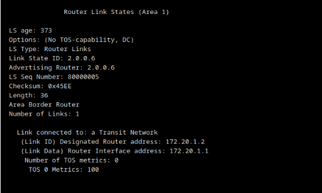
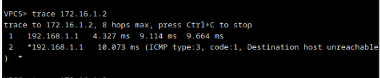
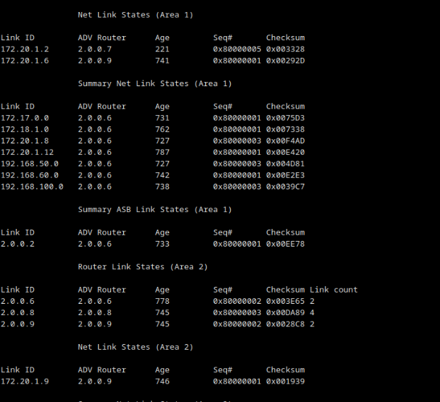

# Trabalho 2 - Encaminhamento dinâmico


## Questões/Traces/Análise

### 1. Arranque os routers R3 até R9 e espere uns minutos. Inicie uma captura de pacotes na ligação entre R2 e R3. Arranque agora R2 e aguarde até aparecer na consola a indicação de que a sua adjacência com R3 passou do estado LOADING para o estado FULL. Pare a captura. (capRes)

**Nota:** captura abaixo foi realizada com filtro ```ospf```


**duvida: ```DB Description``` <=> ```DB Exchange```?**

**duvida: porque que o hello packet do ospf tem como endereço destino o ```224.0.0.5```?**

**Explicação**:

+ ```Hello Packet```: 

    + Anunciar parâmetros em que routers têm que concordar para se poderem tornar vizinhos

    + **Descoberta de vizinhos**

    + Verificar existência de **comunicação bidireccional** entre **vizinhos**

    + **Eleição** de ```DR``` e ```BDR``` 

    + Sinal de vida entre vizinhos (keepalive)


+ ```DB Description```: corresponde a 'mensagens' ospf que demonstram a sincronização de **base dados topologicas** entre ```R2``` e ```R3``` (occore porque R2 acabou-se de ligar a rede) 

+ ```LS Request```: Após ser concluido o processo de ```DB Exchange``` entre ```R2``` e ```R3```, se ```R2``` precisar de um ou mais **LSA** do vizinho ```R3```, pede-os usando ```LS Request``` 

    + Estado ```Loading``` (ainda tem informação por carregar)
    
    + Estado ```Full``` (adjacencia esta completa)

    


+ ```LS Update```: Os ```LSA``` são enviados em ```LS update```:

    + **Com fiabilidade:** cada ```LSA```: deve ser **confirmado**

+ ```LS Acknowledge```: Confirmação feita de recebimento de ```LS Update```.


#### a. Observe o conteúdo dos pacotes DB Description trocados entre R2 e R3. Qual é o objectivo principal da troca destes pacotes? Por que razão é necessário trocá-los sempre que um router estabelece novas adjacências (por exemplo, quando arranca)? (texRes)

    Qual é o objectivo principal da troca destes pacotes?

    R: Sincronização de base de dados topologica de 2 routers

    Por que razão é necessário trocá-los sempre que um router estabelece novas adjacências (por exemplo, quando arranca)

    R: Para garantir que o router e o vizinho com que é estabelecida a adjacência, tem a base dados topológica idêntica


#### b. Observe agora o conteúdo dos pacotes LS Request enviados por R2 a R3 e vice-versa. Para que servem estes pedidos? Como é que cada router sabe o que precisa de pedir ao vizinho? (texRes)

    Para que servem estes pedidos?
    
    R: Concluído o processo DB Exchange, se o router precisar de um
    ou mais LSA do vizinho, pede-os usando mensagens LS Request

    Como é que cada router sabe o que precisa de pedir ao vizinho? 

    R: duvida: não tenho acerteza disto, perguntar ao professor

```LS Request``` de ```R3``` para ```R2``` 


```LS Request``` de ```R2``` para ```R3```


> Arranque também R1 e aguarde até o encaminhamento convergir


### 2. Em R6, corra o comando show ip ospf database router 2.0.0.6.


#### a. Identifique as ligações que R6 anuncia em cada uma das áreas. (texRes)

```Area 0```


    (TODO confirmar resposta) 
    R: Router LSA que anuncia a ligação de transito (Link Id = 192.168.100.2 = Link Data).Também indica que é um Area Border Router.


```Area 1```



    (TODO confirmar resposta) 
    R: Router LSA que anuncia a ligação de transito (Link Id = 172.20.1.2
    e Link Data = 172.20.1.1).Também indica que é um Area Border Router.

```Area 2```


    (TODO confirmar resposta) 
    R: Router LSA que anuncia a ligação ponto-a-ponto com R8 através da interface 172.20.1.14.També anuncia Stub Network à sub-rede correspondente a ligação ponto-a-ponto (172.20.1.12) 


#### b. Compare as ligações que R6 anuncia nas áreas 1 e 2 e relacione-as com o tipo da ligação que R6 tem em cada uma dessas áreas. (texRes)


    R: duvida - (penso que tenha haver com o facto de R8 ter uma ligação via porta serie e R7 ter ligação porta ethernet, mas pedir ao professor ajuda para compreender)


### 3. Pare o router R7 e espere uns minutos. Depois vá ao router R8 e active o debugging de adjacências usando o comando debug ip ospf adj. Inicie uma captura de pacotes na ligação entre R6 e R8 e pare o router R9 por uns minutos.

#### a. Diga o que aconteceu em R8 ao estado do vizinho R9 e qual foi o evento que ocorreu nesse instante e desencadeou essa mudança (texRes)

TODO: confirmar resposta dada (fiz resposta na img/imagem)


#### b. Explique detalhadamente cada um dos LSA enviados por R8 a R6. (capRes + texRes)

**duvida: quando diz para ter os LSA enviados de ```R8``` para ```R6```, esta se a referir os pacotes com endereço origem ```172.20.1.13```  e endereço destino ```224.0.0.5``` (não tinha pacotes com endereço origem ```172.20.1.13``` e endereço destino ```172.20.1.14```)**

> NOTA: Pode parar agora a captura.

```LS Update (R8 para 224.0.0.5)```


```LS Acknowledgement (R8 para 224.0.0.5)```


```LS Acknowledgement (R8 para 224.0.0.5)```


#### c. Comece agora uma captura na ligação entre R8 e R9. Inicie R9 e capture a mensagem que permite a este router saber que tem comunicação bidireccional com R8. Justifique a escolha dessa mensagem (capRes + texRes).
    (TODO- confirmar se é o Hello Packet vindo de 172.20.1.9 (R9))

    R: Para verificar a existencia de comunicação bidirecional entre vizinhos o ospf utiliza o sub protocolo Hello.


#### d. Continue a captura da alínea anterior até o encaminhamento OSPF estabilizar. Analise todos os anúncios (LSA) contidos em todas as mensagens LS Update trocadas entre R8 e R9. Que tipos de anúncio encontrou? Para que serve cada um desses tipos? (texRes)

    Que tipos de anúncio encontrou?

    R: Router LSA, Network Summary LSA , ASBR Summary LSA e AS External LSA

    Para que serve cada um desses tipos? 

    R: 
    Router LSA: Serve para cada router se anunciar e identificar as
    suas ligações

    Network Summary LSA: Injectados pelo ABR numa área para anunciar destinos de outras areas 

    ASBR Summary LSA : permitem tornar o grafo conexo (Sem eles, os destinos importados por ASBR fora da própria área seriam conhecidos mas inatingíveis)


    AS-External LSA: Representam destinos externos ao sistema autónomo OSPF (rotas importadas por um ASBR( Autonomous System Boundary Router))


#### e. Para cada um dos tipos identificados na alínea anterior, diga o que contêm (significado) os campos Link State ID e Advertising Router e identifique e diga o que contêm (significado) outros campos importantes (para a construção do grafo da rede) desse tipo específico, exemplificando com LSA concretos. (texRes)

```Router LSA```


+ Link State ID : Router ID do router que gerou o LSA

+ Advertising Router : router que envia este Router LSA

+ type : o tipo de Router LSA (Ponto-a-ponto, Ligação de trânsito, Ligação stub (ponta) e  Ligação virtual )

+ etc...


```Network Summary LSA```


+ Link State ID : Endereço IP da interface do DR nessa rede 

+ Advertising Router : router que envia este Network Summary LSA

+ etc ...


```ASBR Summary LSA```


+ Link State ID : Router ID do ASBR em questão

+ Advertising Router : router que envia este ASBR Summary LSA

+ Netmask: 0.0.0.0 (sempre assim)

+ etc ...

```AS-External LSA```


+ Link State ID : Endereço IP da rede de destino (prefixo)

+ Advertising Router : router que envia este AS-External LSA

+ Netmask : mascara associada ao Link State Id

+ External type:  indica se é uma rota externa de tipo 1 ou 2

+ etc ...

#### f. Procure o último anúncio do tipo Router LSA originado pelo router R8. Para cada uma das ligações identificadas nesse anúncio, indique o respectivo tipo, bem como os valores dos campos ID e Data e o seu significado. (texRes)


```PTP```

+ Link ID : 2.0.0.6 (Router ID do vizinho) 

+ Data: 172.20.1.13 (Endereço IP do router nessa rede)

```Stub```

+ Link ID: 172.20.1.12 (Prefixo da rede)

+ Data: 255.255.255.252 (Máscara de rede)

```Transit```

+ Link ID: 172.20.1.10 (Endereço IP do DR nessa rede )

+ Data: 172.20.1.10 (Endereço IP do router nessa rede)

```Stub```

    + Link ID: 172.18.1.0 (Prefixo da rede)

+ Data: 255.255.255.0 (Máscara de rede)


#### g. Volte a iniciar R7 e aguarde até o encaminhamento estabilizar. Que notificações (LSA) foram enviadas por R8 a R9? Indique a finalidade de cada uma dessas notificações. (texRes)

    Que notificações (LSA) foram enviadas por R8 a R9?

    R: LS Update e LS Acknowledge

    Indique a finalidade de cada uma dessas notificações.

    TODO: confirmar com o professor a resposta abaixo

    R: Basicamente os LS Update traz a informação relacionada com o arranque do R7, atualizando a base de dados topologica de R8 e R9. LS Acknowlege server para confirmar o recebimento desses LSA.


### 4. Em cada uma das interfaces do R8 corra o comando show ip ospf interface e verifique se na ligação correspondente foi eleito um Designated Router. (outRes)

**Usei ```show ip ospf interface brief``` para ter informação mais resumida**


#### a. Em que ligações foi ou não eleito um DR? Porquê? (texRes)

    duvida: Na interface se2/0 não tenho acerteza o porque de não ter um DR (é por ter sempre adjacencia?)

    R: fa1/1 e fa1/0 foi eleito como DR.No Se2/0 é uma ligação P2P logo não precissa DR por é sempre estavelicido uma adjcência 

#### b. Nas ligações em que existe DR, verifique se é gerado um Network LSA (pode correr em R8 o comando show ip ospf database network). Em que situação é gerado esse tipo de LSA? (texRes)


    Em que situação é gerado esse tipo de LSA? (texRes)

    TODO - confirmar resposta

    R: É enviado pelo DR de cada rede acesso multiplo, e representa o nó virtual da correspondente rede (inclui lista de router's ligado, Router ID)


#### c. Que relação existe entre o originador de um Network LSA e o DR da ligação correspondente? (texRes)

    TODO - confirmar resposta

    R: Network LSA é :
        • Enviado pelo DR de cada rede de acesso múltiplo
        • Representa o nó virtual correspondente à rede
        • Inclui lista de Routers ligados (Router ID)
            – Ligações do nó virtual para os routers reais


### 5. Corra o comando show ip ospf interface <itf> nas interfaces de R3, R4, R5 e R6 ligadas à sub-rede 192.168.100.0

```R3```


```R4```


```R5```


```R6```


#### a. Para cada um dos routers indicados, diga quantas adjacências tem e relacione esse número com o papel desempenhado pelo router na rede de acesso múltiplo. (texRes)

```R3```

+ nr adjacencias: 2

    + Papel: DRother : Routers DROther estabelecem adjacências apenas com o DR e com o BDR ( R6 e R5 respetivamente)


```R4```

+ nr adjacencias: 2
    
    +  Papel: DRother : Routers DROther estabelecem adjacências apenas com o DR e com o BDR (  R6 e R5 respetivamente)

```R5```

+ nr adjacencias: 3

    + Papel: BDR (Back Up DR, portanto tem as mesmas adjacencias que o DR)

```R6```

+ nr adjacencias: 3

    + Papel: DR (tem adjacencia com todos os router ospf presentes nesta sub-rede)

#### b. Para que serve o Designated Router no OSPF? (texRes)

    R:O Designated Router é responsável por:
        – Gerir o processo de inundação de LSA na ligação de acesso múltiplo
        – Gerar informação topológica sobre um nó virtual que representa a ligação de acesso múltiplo


### 6. Faça um traceroute (comando trace no VPCS) do terminal 1 para o terminal 2. Corte a ligação entre R6 e R7 (apenas para esta pergunta) de modo a que o percurso dos pacotes seja desviado para atravessar R8 e R9 e repita o traceroute. (2×outRes)


duvida: é suposto falhar o traceroute?

> cortar ligação entre R6 e R7 





#### a. Em R6, corra o comando show ip ospf database. (outRes)





#### b. Com base no resultado da alínea anterior e no conhecimento que tem do OSPF, justifique a impossibilidade de fazer a alteração pedida. (texRes)


    R: duvida- não percebi qual alteração se refere, penso que seja a alteração de rota para pacote atravesar R8 e R9 , mas não percdbi o porque de não chegar ao terminal 2


>Reponha a ligação entre R6 (F1/1) e R7 (F1/0).


### 7. Inicie capturas nas interfaces 172.20.1.2 e 172.20.1.5 de R7.

> coloquei o filtro ```icmp or arp``` no wireshark de ambas

#### a. Faça um ping do terminal 2 para a interface 172.17.0.1 de R9. Diga qual é o caminho seguido pelos pacotes ICMP echo request e echo reply e explique porquê. (2×capRes + texRes).

```Ligação entre R6 e R7```


```Ligação entre R7 e R9```


    Diga qual é o caminho seguido pelos pacotes ICMP echo request e echo reply e explique porquê

    R: duvida: não consigo identificar o caminho do pacote apenas por ICMP (é suposto usar o trace?)

duvida: se fizer trace da-me para 172.17.0.1 apartir do terminal da-me erro de port unreachable (mas o ping funciona)


#### b. Tente alterar em R9 o custo da interface 172.20.1.6 de modo a que o percurso do echo reply seja o inverso do do echo request. Se conseguiu, diga como; se não conseguiu, explique porquê (texRes).

> NOTA: Para perceber melhor a diferença entre o que se passa nesta pergunta e na pergunta anterior, pode experimentar também cortar a ligação entre R9 e R7.

    R: duvida: pedir ajuda nesta parte 