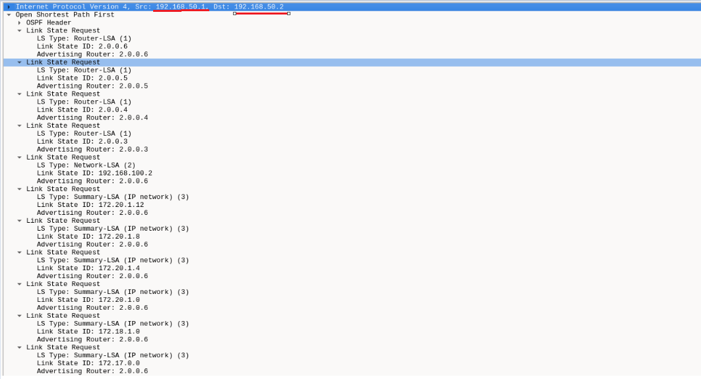
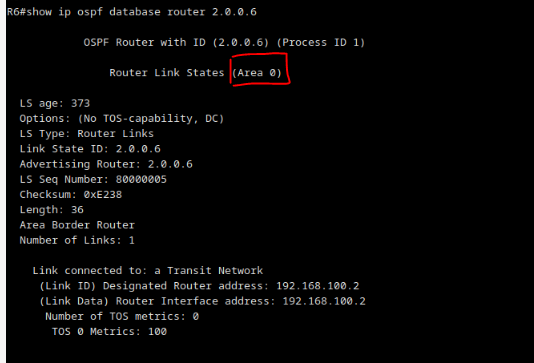
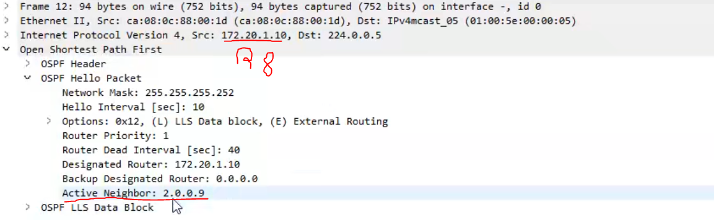
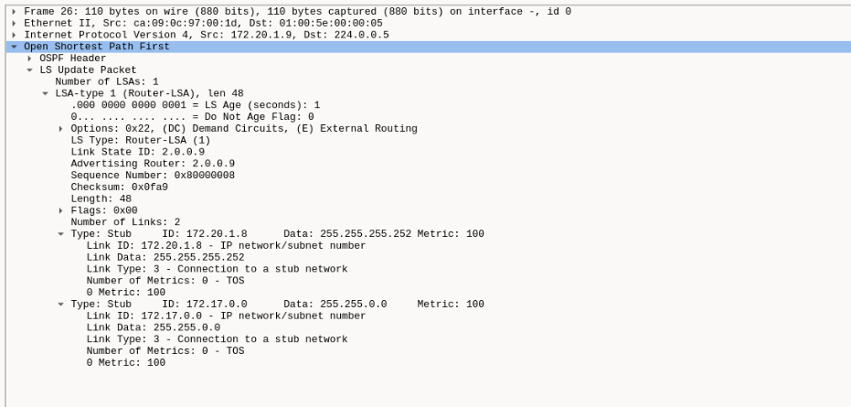
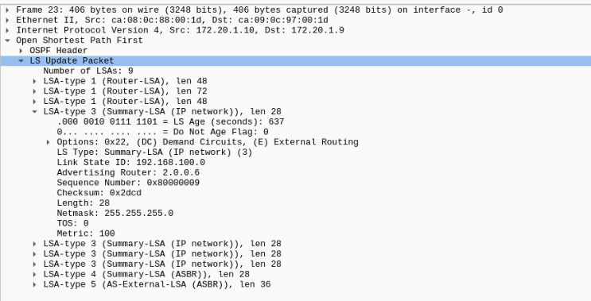

# Trabalho 2 - Encaminhamento dinâmico

**NOTA IMPORTANTE**:

+ ```Redes FastEthernet``` , ou seja  ligações em que usamos ```FastEthernet```, são consideradas ```redes de acesso multiplo```

+ No trabalho temos ```2 sistemas autonomos OSPF``` e um deles esta dividido em ```3 áreas``` 

****

**duvida**: se tivermos apenas 2 router's numa rede ospf não é eleito DR nem BDR (por e.g SUB-REDE ENTRE R1 e R2), certo? 

>R: Sim é na mesma eleito DR e BDR , até porque mais tarde podem se adicionar mais routers (NOTA: redes fastEthernet, são redes de acesso multiplo, ou seja, temos o exemplo da sub-rede que temos entre R2 e R3, que é de acesso multiplo, porque podemos ter-los ligados diretamente, mas tambem podemos ter um switch em que se podem ligar mais computadores)


## Questões/Traces/Análise

### 1. Arranque os routers R3 até R9 e espere uns minutos. Inicie uma captura de pacotes na ligação entre R2 e R3. Arranque agora R2 e aguarde até aparecer na consola a indicação de que a sua adjacência com R3 passou do estado LOADING para o estado FULL. Pare a captura. (capRes)

**Nota:** captura abaixo foi realizada com filtro ```ospf```


**duvida: Na figura abaixo tenho uma captura de um pacote ```DB Exchange``` de ```R2``` para ```R3``` porque é que o LSA que ele envia, tem como ```External LSA```  o lsa enviado por ```2.0.0.2```? (Os ```External LSA``` supostamente não é enviado por ```ASBR's``` que ligam ```sistemas externos ao sistema OSPF```?)**


>R: Esse ```External LSA``` corresponde ao sistema autonomo AS 1 ( representado a laranja na figura).É importante notar que AS1 e AS2 são dois sistemas autonomos distintos e o ```R2``` é o seu ASBR

**duvida: no pacote ```LS Update``` capturado no momento em que R2 é ligado, esta um listado um ```Network LSA ``` vindo de ```2.0.0.3```.Supostamente os ```Network LSA``` não são só enviados em redes de acesso multiplo?(e que R2 e R3 não formam uma rede de acesso multiplo, certo?)**

>R: redes fastEthernet (basicamente são todos as redes que utilizam cabos fastEthernet) são redes de acesso multiplo. (e.g. R1 e R2 são uma rede de acesso multiplo)


**duvida: Acontece algo semelhante a duvida de cima (no caso de pacote ```LS Update``` de ```R2``` para ```R1```, quando ```R1``` liga-se , aparecem como ```External LSA``` os ```LSA's request's``` vindos de ```R2```)**

> R: Porque R2 pertence a dois sistema autonomos OSPF, e no caso esta a redistribuir a parte do sistema autonomo AS2 para AS1


**duvida: ```DB Description``` <=> ```DB Exchange```?**
> R: No processo ```DB Exchange``` são trocados pacotes DB Description ```DB Description```

**duvida: porque que o hello packet do ospf tem como endereço destino o ```224.0.0.5```?**

>R: Para reduzir o tráfego de encaminhamento , em redes broadcast ou ponto-a-ponto os LSA são enviados em multicast. (224.0.0.5 (“todos os routers OSPF”) para o DR enviar para os outros)


**Explicação**:

+ ```Hello Packet```: 

    + Anunciar parâmetros em que routers têm que concordar para se poderem tornar vizinhos

    + **Descoberta de vizinhos**

    + Verificar existência de **comunicação bidireccional** entre **vizinhos** (quando um router vê o seu Router ID num Hello recebido ,sabe que tem comunicação bidireccional com o vizinho que
    o enviou)

    + **Eleição** de ```DR``` e ```BDR``` 

    + Sinal de vida entre vizinhos (keepalive)


+ ```DB Description```: corresponde a 'mensagens' ospf que demonstram a sincronização de **base dados topologicas** entre ```R2``` e ```R3``` (occore porque R2 acabou-se de ligar a rede) 

+ ```LS Request```: Após ser concluido o processo de ```DB Exchange``` entre ```R2``` e ```R3```, se ```R2``` precisar de um ou mais **LSA** do vizinho ```R3``` (ou vice-versa), pede-os usando ```LS Request``` (a resposta vem em ```LS Update's``` que vão conter os ```LSA``` pedidos) 

    + Estado ```Loading``` (ainda tem informação por carregar)
    
    + Estado ```Full``` (adjacencia esta completa)


    


+ ```LS Update```: Os ```LSA``` são enviados em ```LS update```:

    + **Com fiabilidade:** cada ```LSA```: deve ser **confirmado**

+ ```LS Acknowledge```: Confirmação feita de recebimento de ```LS Update```.


#### a. Observe o conteúdo dos pacotes DB Description trocados entre R2 e R3. Qual é o objectivo principal da troca destes pacotes? Por que razão é necessário trocá-los sempre que um router estabelece novas adjacências (por exemplo, quando arranca)? (texRes)

    Qual é o objectivo principal da troca destes pacotes?

    (nossa resposta)
    R: Sincronização de base de dados topologica de 2 routers, que querem estabelecer adjacencia.

    Por que razão é necessário trocá-los sempre que um router estabelece novas adjacências (por exemplo, quando arranca)

    R: Para garantir que o router e o vizinho com que é estabelecida a adjacência, tem a base dados topológica idêntica

    (Resposta do professor)
    O objetivo principal dos pacotes DD (sub-protocolo DB Exchange) é cada router enviar
    meta-informação sobre todos os LSA que tem na sua B.D topologica para que se faltar 
    ao vizinho algum algum desses LSA ele possa pedi-lo (LS Request).Ao estabelecer
    adjacencia é necessário sincronizar as B.D topologicas para garantir que todos os 
    router's usam exatamente a mesma B.D topologica para que o calculo de caminhos mais 
    curtos seja consistente.

    


#### b. Observe agora o conteúdo dos pacotes LS Request enviados por R2 a R3 e vice-versa. Para que servem estes pedidos? Como é que cada router sabe o que precisa de pedir ao vizinho? (texRes)

    (nossa resposta) 

    Para que servem estes pedidos?
    
    R: Concluído o processo DB Exchange, se o router precisar de um
    ou mais LSA do vizinho , pede-os usando mensagens LS Request

    Como é que cada router sabe o que precisa de pedir ao vizinho? 

    R: Após o processo DB Exchange estar completo, ambos os vizinhos sabem quais LSA's precisam pedir aos seus vizinhos via LS Request

    (Resposta do professor)

    Os pacotes LS Request servem para um router pedir ao vizinho LSA que ainda não tem ou dos quais tem uma
    versão não atualizada. O router sabe o que precissa pedira ao vizinho comparando os LS Header's que ele
    lhe enviou nos pacotes DD com o conteúdo da sua própria B.D topologicas.

```LS Request``` de ```R3``` para ```R2``` 

+ ```R3``` pede a ```R2``` os ```LSA``` que estão em falta na sua B.D topologica


```LS Request``` de ```R2``` para ```R3```

+ ```R2``` pede a ```R3``` os ```LSA``` que estão em falta na sua B.D topologica




> Arranque também R1 e aguarde até o encaminhamento convergir


### 2. Em R6, corra o comando show ip ospf database router 2.0.0.6.


#### a. Identifique as ligações que R6 anuncia em cada uma das áreas. (texRes)

```Area 0```



    R: Router LSA que anuncia a ligação de transito (Link Id = 192.168.100.2 = Link Data).Também indica que é um Area Border Router.


```Area 1```


    R: Router LSA que anuncia a ligação de transito (Link Id = 172.20.1.2
    e Link Data = 172.20.1.1).Também indica que é um Area Border Router.

```Area 2```


    R: Router LSA que anuncia a ligação ponto-a-ponto numerada com R8 através da interface 172.20.1.14.Como a ligação ponto-a-ponto é numerada, também anuncia Stub Network à sub-rede correspondente a ligação ponto-a-ponto (172.20.1.12).

>Nota: Uma ligação ```ponto-a-ponto``` **numerada** aparece na ```base de dados topologica``` como:  uma ligação ```ponto-a-ponto``` mais uma ligação ```Stub``` à ```sub-rede``` correspondente


#### b. Compare as ligações que R6 anuncia nas áreas 1 e 2 e relacione-as com o tipo da ligação que R6 tem em cada uma dessas áreas. (texRes)


    R: 

    Area 0 e Area 1: Indicam as ligações de transito a que estão ligadas

    Area 2: Como temos uma ligação ponto-a-ponto numerada (utilizando cabo serie) temos que associar uma stub-network para ser possivel outras maquinas comunicarem com as interfaces numeradas nesta rede ponto-a-ponto


### 3. Pare o router R7 e espere uns minutos. Depois vá ao router R8 e active o debugging de adjacências usando o comando debug ip ospf adj. Inicie uma captura de pacotes na ligação entre R6 e R8 e pare o router R9 por uns minutos.

#### a. Diga o que aconteceu em R8 ao estado do vizinho R9 e qual foi o evento que ocorreu nesse instante e desencadeou essa mudança (texRes)


>Nota: ele descobre que R9 está desligado porque ele deixou de responder aos pacotes ```Hello```


#### b. Explique detalhadamente cada um dos LSA enviados por R8 a R6. (capRes + texRes)

**duvida: quando diz para ter os LSA enviados de ```R8``` para ```R6```, esta se a referir os pacotes com endereço origem ```172.20.1.13```  e endereço destino ```224.0.0.5``` (não tinha pacotes com endereço origem ```172.20.1.13``` e endereço destino ```172.20.1.14```)**

>R: sim 

> NOTA: Pode parar agora a captura.

```LS Update (R8 para 224.0.0.5)```


```LS Acknowledgement (R8 para 224.0.0.5)```


```LS Acknowledgement (R8 para 224.0.0.5)```


#### c. Comece agora uma captura na ligação entre R8 e R9. Inicie R9 e capture a mensagem que permite a este router saber que tem comunicação bidireccional com R8. Justifique a escolha dessa mensagem (capRes + texRes).

    R: Para verificar a existencia de comunicação bidirecional entre vizinhos o ospf utiliza o sub protocolo Hello.
    Portanto quando R8 envia o Pacote Hello e lista o R9 como Active neighbour, o R9 sabe que tem conectividade com R8 
    e tem comunicação biderecional com ele 

>Nota: O ```primeiro pacote Hello```  em que um router se ve listado como ```Active neihgbour``` por um vizinho, permite ao router afirmar que ```tem comunicação bidirecional com esse vizinho```
 


>Nota: Um router também pode afirmar que ```tem comunicação bidirecional com um vizinho``` se lhe estiver a enviar pacotes ```DB Description```


#### d. Continue a captura da alínea anterior até o encaminhamento OSPF estabilizar. Analise todos os anúncios (LSA) contidos em todas as mensagens LS Update trocadas entre R8 e R9. Que tipos de anúncio encontrou? Para que serve cada um desses tipos? (texRes)

    Que tipos de anúncio encontrou?

    R: Router LSA,Network LSA, Network Summary LSA , ASBR Summary LSA e AS External LSA

    Para que serve cada um desses tipos? 

    R: 
    Router LSA: Serve para cada router se anunciar e identificar as
    suas ligações (Intra-área)

    Network LSA: Originado pelo DR numa rede de acesso multiplo para anunciar o nó virtual
    que permite tranformar uma ligação de acesso multiplo num grafo (também contém informação
    sobre quais router's estão ligados a essa rede de acesso multiplo)

    Network Summary LSA: Injectados pelo ABR numa área para anunciar destinos (redes Ip) de outras areas 

**duvida**: Os pacotes OSPF  ```ASBR Summary LSA``` e  ```AS-External LSA```, não são trocados apenas entre ```sistemas que estão fora do dominio OSPF```? (é que quer ```R8``` quer ```R9``` estão dentro do dominio OSPF, e mesmo assim trocam estes pacotes no ```LS Update```)

>R: Sim mas estes pacotes ```ASBR Summary LSA``` e ```AS-External LSA``` originam no sistema autonomo AS1 (e vem do router ```2.0.0.2```, propagados pelo sistema OSPF)

    ASBR Summary LSA : permitem tornar o grafo conexo (Sem eles, os destinos importados por ASBR fora da própria área seriam conhecidos mas inatingíveis). Resumidamente indicam , em cada área, como chegar ao ASBR .


    AS-External LSA: Representam destinos externos ao sistema autónomo OSPF (rotas importadas por um ASBR( Autonomous System Boundary Router)), neste caso vem do sistema autonomo AS1.


#### e. Para cada um dos tipos identificados na alínea anterior, diga o que contêm (significado) os campos Link State ID e Advertising Router e identifique e diga o que contêm (significado) outros campos importantes (para a construção do grafo da rede) desse tipo específico, exemplificando com LSA concretos. (texRes)

```Router LSA```



+ Link State ID : Router ID do router que gerou o LSA

+ Advertising Router : router que envia este Router LSA

+ type : o tipo de Router LSA e respetivos Link Id e Link Data(Ponto-a-ponto, Ligação de trânsito, Ligação stub (ponta) e  Ligação virtual )


```Network LSA```


+ Link State Id: endereço ip da interface DR nessa rede 

+ Advertising Router: ID do DR da rede 

+ NetMask: Máscara da rede de acesso multiplo 

+ Attached Router: Id de cada um dos router's ligados à rede de acesso multiplo

```Network Summary LSA```



+ Link State ID : Endereço IP da interface do DR nessa rede 

+ Advertising Router : router que envia este Network Summary LSA

+ NetMask: Máscara da rede de destino acesso multiplo

```ASBR Summary LSA```


+ Link State ID : Router ID do ASBR em questão

+ Advertising Router : ID do ASBR

+ Netmask: 0.0.0.0 (sempre assim)

```AS-External LSA```


+ Link State ID : Endereço IP da rede de destino (prefixo)

+ Advertising Router : router que envia este AS-External LSA

+ Netmask : mascara da rede destino

#### f. Procure o último anúncio do tipo Router LSA originado pelo router R8. Para cada uma das ligações identificadas nesse anúncio, indique o respectivo tipo, bem como os valores dos campos ID e Data e o seu significado. (texRes)


```PTP```

+ Link ID : 2.0.0.6 (Router ID do vizinho) 

+ Data: 172.20.1.13 (Endereço IP do router nessa rede)

```Stub```

+ Link ID: 172.20.1.12 (Prefixo da rede)

+ Data: 255.255.255.252 (Máscara de rede)

```Transit```

+ Link ID: 172.20.1.10 (Endereço IP do DR nessa rede )

+ Data: 172.20.1.10 (Endereço IP do router nessa rede)

```Stub```

+ Link ID: 172.18.1.0 (Prefixo da rede)

+ Data: 255.255.255.0 (Máscara de rede)


#### g. Volte a iniciar R7 e aguarde até o encaminhamento estabilizar. Que notificações (LSA) foram enviadas por R8 a R9? Indique a finalidade de cada uma dessas notificações. (texRes)

    (nossa resposta)

    Que notificações (LSA) foram enviadas por R8 a R9?

    R: LS Update e LS Acknowledge

    Indique a finalidade de cada uma dessas notificações.

    TODO: confirmar com o professor a resposta abaixo

    R: Basicamente os LS Update traz a informação relacionada com o arranque do R7, atualizando a base de dados topologica de R8 e R9. LS Acknowlege server para confirmar o recebimento desses LSA.

    (Resposta do professor)

> Ver imagem abaixo com resposta do professor (captura de o LS Update)


### 4. Em cada uma das interfaces do R8 corra o comando show ip ospf interface e verifique se na ligação correspondente foi eleito um Designated Router. (outRes)

**Usei ```show ip ospf interface brief``` para ter informação mais resumida**


#### a. Em que ligações foi ou não eleito um DR? Porquê? (texRes)

    duvida: Na interface se2/0 não tenho acerteza o porque de não ter um DR (é por ter sempre adjacencia?)

> R: fa1/1 e fa1/0 foi eleito como DR (porque sao ligações FastEthernet, que é uma ligação de acesso multiplo).No Se2/0 é uma ligação P2P logo não precissa DR por é sempre estavelicido uma adjcência 

#### b. Nas ligações em que existe DR, verifique se é gerado um Network LSA (pode correr em R8 o comando show ip ospf database network). Em que situação é gerado esse tipo de LSA? (texRes)


**duvida**: Neste trabalho a unica ```rede de acesso multiplo``` é R3, R4, R5 e R6? (senão, **como é que definimos** uma ```rede de acesso multiplo```)

>R: ```Não```, e temos mais redes de acesso multiplo, por e.g todas as ```conexões FastEthernet``` que temos entre **2 ou mais** router's ou mais formam uma rede de acesso multiplo , porque mais tarde podem-se ligar a essas redes mais maquinas utilizando um ```Switch``` (e.g. da rede que contem R3,R4,R5 e R6 que tem uma rede de acesso multiplo demonstrada explicitamente)


    Em que situação é gerado esse tipo de LSA? (texRes)
    
    R: É enviado pelo DR de cada rede acesso multiplo, e representa o nó virtual da correspondente rede (inclui lista de router's ligado, Router ID).É apenas gerado em ligações de transito (acesso multiplo)


#### c. Que relação existe entre o originador de um Network LSA e o DR da ligação correspondente? (texRes)

    R: Network LSA é  :
        • Enviado pelo DR de cada rede de acesso múltiplo
        • Representa o nó virtual correspondente à rede
        • Inclui lista de Routers ligados (Router ID)
            – Ligações do nó virtual para os routers reais

    ()

### 5. Corra o comando show ip ospf interface <itf> nas interfaces de R3, R4, R5 e R6 ligadas à sub-rede 192.168.100.0

```R3```


```R4```


```R5```


```R6```


#### a. Para cada um dos routers indicados, diga quantas adjacências tem e relacione esse número com o papel desempenhado pelo router na rede de acesso múltiplo. (texRes)

```R3```

+ nr adjacencias: 2

    + Papel: DRother : Routers DROther estabelecem adjacências apenas com o DR e com o BDR ( R6 e R5 respetivamente)


```R4```

+ nr adjacencias: 2
    
    +  Papel: DRother : Routers DROther estabelecem adjacências apenas com o DR e com o BDR (  R6 e R5 respetivamente)

```R5```

+ nr adjacencias: 3

    + Papel: BDR (Back Up DR, portanto tem as mesmas adjacencias que o DR, excetuando a adjcencia que DR tem com BDR, neste caso temos adjacencia do BDR com DR)

```R6```

+ nr adjacencias: 3

    + Papel: DR (tem adjacencia com todos os router ospf presentes nesta sub-rede)

#### b. Para que serve o Designated Router no OSPF? (texRes)

    R:O Designated Router é responsável por:
        – Gerir o processo de inundação de LSA na ligação de acesso múltiplo
        – Gerar informação topológica sobre um nó virtual que representa a ligação de acesso múltiplo


### 6. Faça um traceroute (comando trace no VPCS) do terminal 1 para o terminal 2. Corte a ligação entre R6 e R7 (apenas para esta pergunta) de modo a que o percurso dos pacotes seja desviado para atravessar R8 e R9 e repita o traceroute. (2×outRes)

>Screenshot antes de cortar ligação entre R6 e R7 (no router R6 corri o comando ```show ip ospf database router 2.0.0.7``` para verificar o que ```R7``` anuncia para ```R6``` através do seu ````Router LSA```). Verificamos que a rede ```172.16.1.0/24``` so é anunciado por ```R7``` e é injetada atraves de um sumario (```Network Summary LSA```) por o ABR R6 para as restantes áreas.


duvida: é suposto falhar o traceroute?
>R: Sim, basicamente quando cortamos a ligação entre R6 e R7 não temos forma como chegar ao terminal 2.A primeira parece que existe um caminho alternativo via R9, mas como só o ABR (neste caso R6) é que poderia injetar essa informação para o ospf e o unico contacto com esse ABR é por o R7, isso deixa de ser possivel.

>Também pensei que o router ```R9``` podia ```injetar esses sumarios pela rede```, mas apenas o ```ABR``` pode fazer isto (R6)

>Para confirmar o que o ```R9``` esta a 'enviar' para ```R6``` (ou qualquer outro Router) podemos correr o comando show ip ospf database router 2.0.0.9 (ou o id que queremos ver ).Na imagem abaixo apenas contem a porção vinda da area 2 


> cortar ligação entre R6 e R7 (informação que R6 e R7 não tem conexão ainda não se tinha propagado)


>No caso abaixo, a informação que não temos forma de chegar ao term2 já se propagou pela rede (portanto nem sai do primeiro router)


>Se verificarmos como o comando ```show ip ospf database router 2.0.0.7``` no ```R6``` verificamos que ainda temos a informação de que para chegar a ```172.16.1.2``` temos de usar ```R7```, mas aparece como ```Router is not reachable``` (se verificarmos os restantes ```show ip ospf database router 2.0.0.x```, confirmamos que nenhum delese conhece a rede ```172.16.1.0/24```). Também passa a sub-rede para uma ```Rede Stub``` (antes estava como ```Rede de trânsito```)


#### a. Em R6, corra o comando show ip ospf database. (outRes)


#### b. Com base no resultado da alínea anterior e no conhecimento que tem do OSPF, justifique a impossibilidade de fazer a alteração pedida. (texRes)


    R: duvida- não percebi qual alteração se refere, penso que seja a alteração de rota para pacote atravesar R8 e R9 , mas não percdbi o porque de não chegar ao terminal 2

>R: Mais acima tem a justificação em concreto, mas basicamente não temos informação para chegar lá


>Reponha a ligação entre R6 (F1/1) e R7 (F1/0).


### 7. Inicie capturas nas interfaces 172.20.1.2 e 172.20.1.5 de R7.

> coloquei o filtro ```icmp or arp``` no wireshark de ambas

#### a. Faça um ping do terminal 2 para a interface 172.17.0.1 de R9. Diga qual é o caminho seguido pelos pacotes ICMP echo request e echo reply e explique porquê. (2×capRes + texRes).

```Ligação entre R6 e R7```


```Ligação entre R7 e R9```


    Diga qual é o caminho seguido pelos pacotes ICMP echo request e echo reply e explique porquê


    R: 
    Basicamento o echo request vai por Term2 -> R7 -> R6 -> R8 -> R9 (porque so conhecemos a rede 172.17.0.1 , que esta numa area diferente da area que originou o ping), e apenas o ABR (R6) e que tem essa informação, e ele mesmo injetou esses sumarios a indicar que conhece a rede 172.17.0.1 (mesmo que 172.17.0.1 esteja no R9, essa interface esta numa area diferente logo não é utilizado num caminho de ida).

    O echo reply vai por R9->R7 , porque quando chegamos a R9 e vemos as 'possiveis' rotas, vemos que existe uma rota INTRA-área, que é sempre preferida em contraposicação a qualquer outra


#### b. Tente alterar em R9 o custo da interface 172.20.1.6 de modo a que o percurso do echo reply seja o inverso do do echo request. Se conseguiu, diga como; se não conseguiu, explique porquê (texRes).

> NOTA: Para perceber melhor a diferença entre o que se passa nesta pergunta e na pergunta anterior, pode experimentar também cortar a ligação entre R9 e R7.

    (resposta do professor)
    R: Configuramos a interface 172.20.1.6 o custo R9 para maximo (com o comando ip ospf cost valor_maximo).Contudo, mesmo que façamos isso, o echo reply vem na mesma por 172.20.1.6 porque se trata de uma rota INTRA-area (pelas preferencias ospf, as rotas INTRA-área são sempre preferidas em contraposição em qualquer rota)

    (Se cortamos ligação entre R7 e R9, ele vai usar o camino INTER-área porque deixa de ter um caminho INTRA-área)


> A informação ```INTRA-área``` (```todos osrouter's na mesma área tem a mesma B.D topologica```) é sempre mais precissa do que a ```INTER-área``` (```Router's de diferentes áreas apenas contém informação sumarizada de um e outro```)