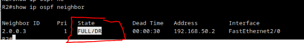
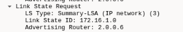
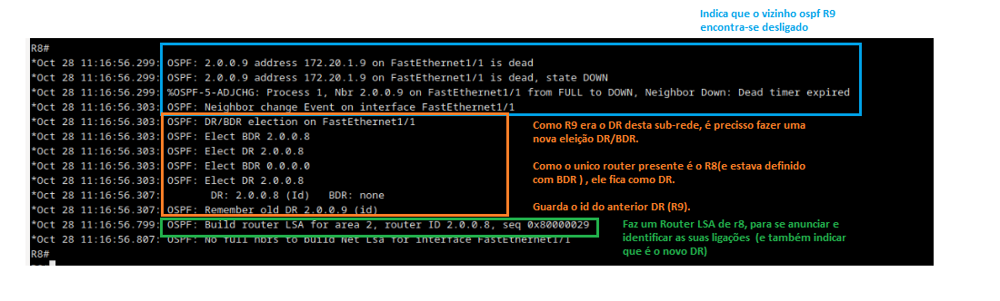
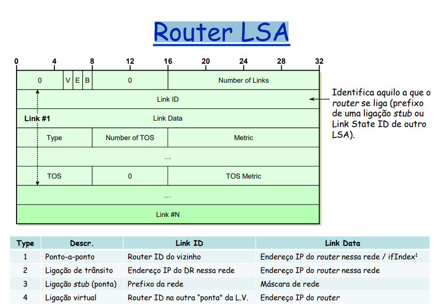

# Exemplo configuração OSPF (ver video que esta no moodle)

## Configurações OSPF

### Router R1

    1. enable
    2. sh ip int brief

    3. conf t 
    4. router opsf 1 (o 1 é um identificador da instancia OSPF que vamos configurar, util quando temos varios sistemas OSPF no mesmo router)

**Professor recomenda configurar o router id manualmente**

    5. router-id 0.0.0.1

**Configuração do calculo do custo da interface (se não configuramos, é calculado automaticamente pelo router)**

    6. auto-cost reference-bandwidth 10000 (10000MBps <=> 10Gbs)

**Necessario definir quais as interfaces que fazem parte do OSPF (professor diz que ha duas formas, nesta usou comando network)**

+ **Wildcard mask**: basicamente pegamos na mascara original e invertemos bit a bit (10.0.1.0/24)
+ **area 0**: area a que pertence a interface
****

    7. network 10.0.1.0 0.0.0.255 area 0 

**Na interface que não faz parte do OSPF, se quisermos importar as suas rotas para dentro do ospf, ou seja , seja anunciado para dentro do OSPF como destino externo**

    8. redistribute connected metric 500

    9. end 

**Demontração de informação OSPF**

    10. show ip osf database 

    11. show ip ospf interface brief

    # Não aparece nenhum porque ainda não estabeleceu nenhuma adjcencia
    12. show ip ospf neighbor
    

### Router R2

    1. enable
    2. conf t 
    3. router ospf 1 (o 1 é um identificador da instancia OSPF que vamos configurar, util quando temos varios sistemas OSPF no mesmo router)

**Professor recomenda configurar o router id manualmente**

    4. router-id 0.0.0.2

**Configuração do calculo do custo da interface (se não configuramos, é calculado automaticamente pelo router)**

    5. auto-cost reference-bandwidth 10000

**Necessario definir quais as interfaces que fazem parte do OSPF (professor diz que ha duas formas, neste caso configurou interface a interface)**

    6.  exit 
    7.  int f1/0
    8.  ip ospf 1 area 0  (interface f1/0 passa a pertencer ao ospf com id 1 e esta funcionar na area 0)
    9.  exit
    10. int f0/0 
    12. ip ospf 1 area 0  (interface f0/0 passa a pertencer ao ospf com id 1 e esta funcionar na area 0)
    13. exit
    14. int f1/1
    15. ip ospf 1 area 0  (interface f1/1 passa a pertencer ao ospf com id 1 e esta funcionar na area 0)
    16. end

**Demontração de informação OSPF (Com explicação)**

    17. show ip osf database 

    18. show ospf int brief

### Router R3

    1. enable
    2. conf t 
    3. router ospf 1 (o 1 é um identificador da instancia OSPF que vamos configurar, util quando temos varios sistemas OSPF no mesmo router)

**Professor recomenda configurar o router id manualmente**

    4. router-id 0.0.0.3

**Configuração do calculo do custo da interface (se não configuramos, é calculado automaticamente pelo router)**

    5. auto-cost reference-bandwidth 10000

**Necessario definir quais as interfaces que fazem parte do OSPF (professor diz que ha duas formas, nesta usou comando network)**

+ A configuração abaixo é como se fosse default gateway (qualquer endereco ip de qualquer interface vai funcionar no ospf)

****

    6. network 0.0.0.0 255.255.255.255 area 1 

    7. end

**Demontração de informação OSPF (Com explicação)**

    8. show ip osf database

    9. sh ip opsf int brief 

    10. show ip ospf neighbor 

    11. sh ip route 

## Confirmação de funcionamento

Basta fazer ping apartir de um PC para **cada uma das interfaces** dos PC's/Router's