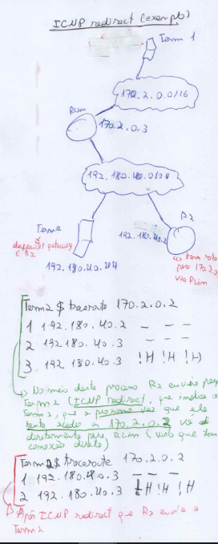
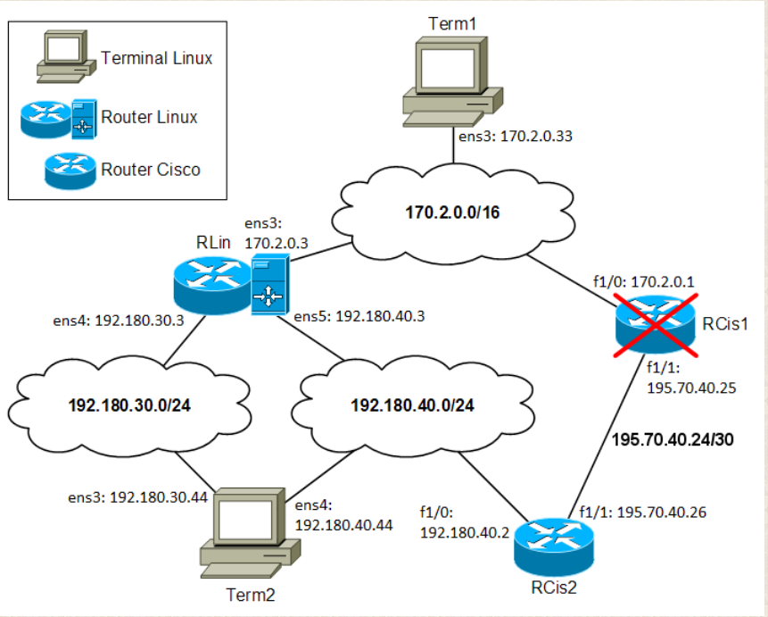

# Trabalho 1 - Encaminhamento estático

## Configuraçao rotas estáticas

### RCis1 deve ter uma rota para 192.180.40.0/24 através de RCis2
    1- enable
    2-config terminal
    3-ip route 192.180.40.0 255.255.255.0 195.70.40.26
    NOTA: para verificar a rota configurada, use o comando `show run (temos de fazer isto pois as interfaces ainda não estão configuradas)`

 ### RCis2 deve ter uma rota para 170.2.0.0/16 através de RCis1
    1- enable1
    2-config terminal
    3. ip route 170.2.0.0 255.255.0.0 195.70.40.25
    NOTA: para verificar a rota configurada, use o comando `show run (temos de fazer isto pois as interfaces ainda não estão configuradas)`

### Term1 configuraçao rotas
 #### padrão (default) através de RLin e para 192.180.40.0/24 através de RCis1
    1-log in (user:root pass:admredes24)
    2-configurar interface
    3-nmtui
        3.1 edit ens3
        3.2 IPV4 configuration: Manual
        3.3 addresses 170.2.0.33/16
        3.4 gateway 170.2.0.3
        3.5 routing (edit)
        3.6 Destination: 192.180.40.0/24 Nex hop : 170.2.0.1 Metric ---
        3.7 OK -> BACK
        3.8 Activate Connection -> ens3
 NOTA:para verificar se a configuraçao esta correta ifconfig

 #### A rota-padrão de Term2 é através de RCis2
  1- nnmtui
    1.1 addresses 192.180.40.44/24
    1.2 192.180.40.2
    1.3 OK -> BACK
    1.4 Activate Connection -> ens4
 NOTA:para verificar se a configuraçao esta correta ifconfig

#### RLin e RCis2 sem rota-padrão (configurar endereços estaticos das interfaces)

##### Configurar  interfaces RLin
    1- nmtui
    2- edit ens3
        2.1 IPV4 configuration: Manual
        2.2-Adresses 170.2.0.3/16
    3-edit ens4
        3.1- IPV4 configuration: Manual
        3.2 - Adresses 192.180.30.3/24
    4-edit ens4
        4.1- IPV4 configuration: Manual
        4.2 - Adresses 192.180.40.3/24
    5-  OK -> BACK
Para todas as interfaces fazer:
    Activate Connection -> ensX
    NOTA:para verificar se a configuraçao esta correta ifconfig ensX
**NOTA:Nao esquecer de ativar o forwarding nos routers que sao linux, adicionando a linha net.ipv4.ip_forward=1 em /etc/sysctl.conf e dpois correr o comando sysctl -p**

##### Configurar  interfaces RCis2
    1-enable
    2-config terminal
    3-interface f1/1 (FastEthernet 1/1)
    4- ip address 195.70.40.26 255.255.255.252 -> no shutdown
    5- interface f1/0
    6- ip address 192.180.40.2 255.255.255.0 -> no shutdown
    7- end
    8-copy running-config startup-config
NOTA: para confirmar configuraçao interfaces usar show ip interface brief 

##### Configurar interfaces RCis1
    1-enable
    2-config terminal
    3-interface f1/1 (FastEthernet 1/1)
    4- ip address 195.70.40.25 255.255.255.252 -> no shutdown
    5- interface f1/0
    6- ip address 170.2.0.1 255.255.0.0 -> no shutdown
    7- end
    8-copy running-config startup-config
NOTA: para confirmar configuraçao interfaces usar show ip interface brief 

    

### Questões/Traces/Análise
 
1-Connectividade:

    a.Faça traceroute do Term2 para cada uma das interfaces do RLin.(outRes)
            Traceroute para ens5 funciona, mas o traceroute para o ens4 nao funciona. Este comportamento e espectavel, pois nao foram feitas configuraçoes nao foram feitas entre ens4 e ens3(Para funcionar deveremos configurar de forma semelhante como no ponto 'A rota-padrão de Term2 é através de RCis2')

    b.Faça traceroute do Term1 para cada uma das interfaces do Term2 nas seguintes condições:
        i.RCis2 sem rota para a rede 170.2.0.0/16 (outRes)
            traceroute 192.180.30.44 ou traceroute 192.180.40.44  -> chega até ao RLin, mas nao consegue sair de la, pois ainda nao tem rota configurada.

        ii.RCis2 com rota para a rede 170.2.0.0/16 através de RCis1 (outRes); indique também o comando usado para criar a rota (confRes)

        ii.RCis2 com rota para a rede 170.2.0.0/16 através de RLin (outRes)
    c.Desligue agora o RCis1 para simular que avariou e repita a alínea anterior.
    NOTA: RCis1 deverá permanecer desligado para o resto do trabalho.
    d.Explique o que se passa em cada um dos casos na alínea anterior. (texRes)
    e.Tendo em conta as duas alíneas anteriores, identifique condições genéricas que tornam vantajoso o uso de encaminhamento dinâmico numa rede. Justifique. (texRes)
    f.Faça um traceroute do Term2 para o Term1 nas três condições indicadas na alínea b. (outRes)
    g.Tendo em conta os resultados da alínea anterior, seria útil ter encaminhamento dinâmico nos routers para conseguir resposta ao traceroute? Justifique.(texRes)
    h.Em RCis2, coloque a rota para a rede 170.2.0.0/16 através de RLin.
        i.Inicie uma captura na ligação de Term2 à sub-rede 192.180.40.0/24; faça traceroute desse terminal para um endereço IP da rede 170.2.0.0/16 ao qual não corresponda nenhuma máquina. Repita o traceroute (a saída deve ser diferente; caso seja igual, repita os dois traceroutes com outro endereço IP). (outRes + capRes)
        ii.Por que razão é diferente a saída do traceroute? (texRes)

