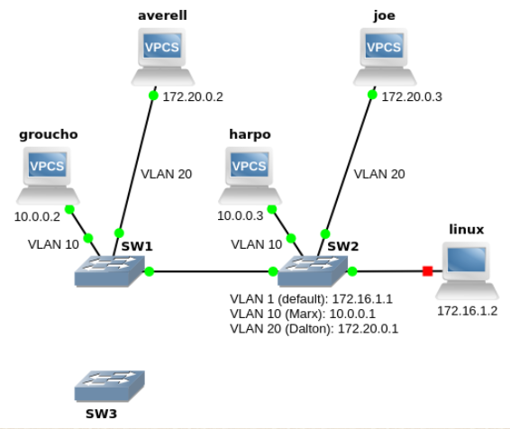
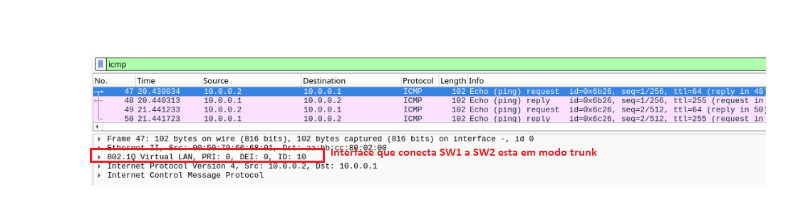
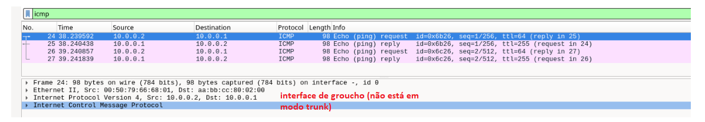
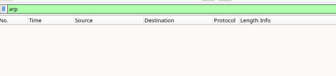
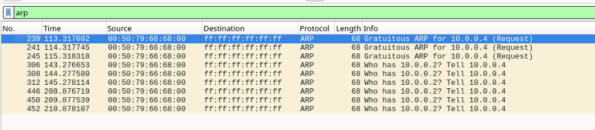

# Trabalho 5 - VLAN e (R)STP



# Questões/Traces/Análise


## 1. Inicie capturas wireshark no groucho e na interface e1/0 de SW2.

## a. Faça um ping de groucho para SW2 e capture o primeiro ICMP Echo Request enviado em ambas as interfaces. As imagens das capturas devem ilustrar claramente as diferenças. (2×capRes)






## b. Quais foram as diferenças encontradas e a que se devem? (texRes)

R: As diferenças encontradas foram que no ```ICMP- echo request``` que esta na **ligação entre SW1 e SW2** encontra-se em ```modo trunk```, enquanto que a **ligação entre groupcho e SW1** encontra-se em ```modo acesso```

## 2. Inicie capturas wireshark em groucho e na interface e1/0 de SW2. Altere o endereço IP de averell para 10.0.0.4, que pertence à mesma subnet de groucho ( ip 10.0.0.4/24 10.0.0.1 ). Faça um ping de averell para groucho. Diga o que observa e explique a razão para ser assim. (texRes)


+ Altere o endereço IP de averell para 10.0.0.4, que pertence à mesma subnet de groucho

    + ```ip 10.0.0.4/24 10.0.0.1```

+ Faça um ping de averell para groucho

    + ping 10.0.0.2


> Captura da **interface groucho**



> Captura da **interface avarell**



R: Como **groucho** e **avarell** estão em diferentes LAN, e portanto estão em diferentes ```redes difusão```, quando **averell** excuta o ping, e tenta descobrir o ```MAC address``` para o endereço ip **10.0.0.2** (groucho).Não obtem resposta, porque dentro da sua ```rede difusão``` não se encontra nenhuma máquina com esse endereço ip.

> Reponha agora o endereço IP original de averell:  ip 172.20.0.2/24 172.20.0.1 


```TODO: FAZER AS RESTANTES PERGUNTAS```